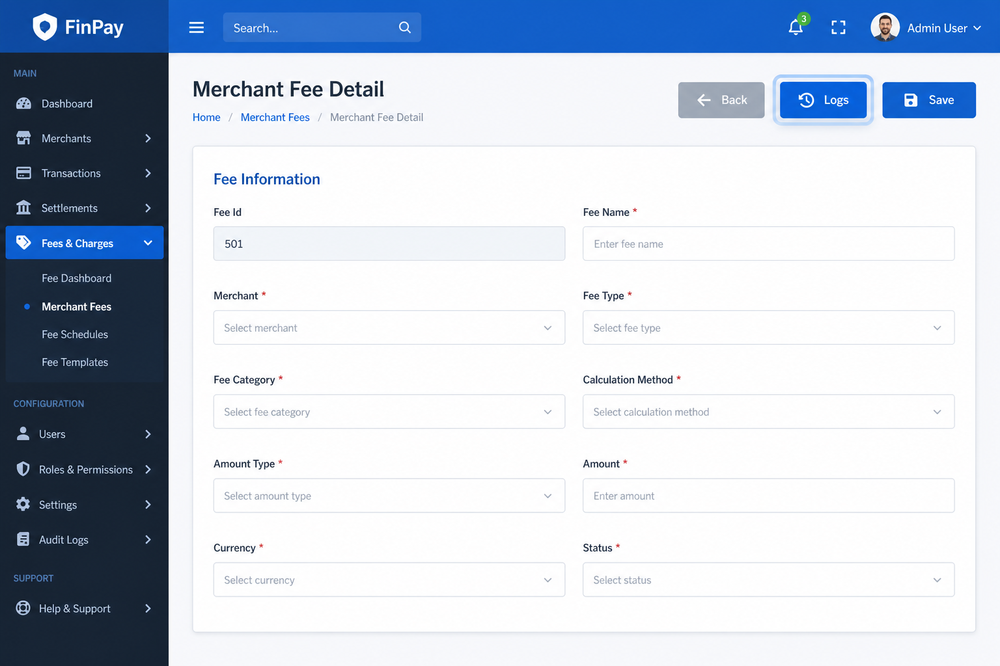
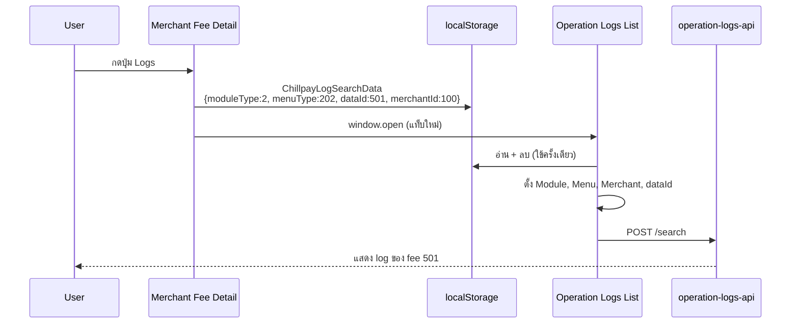

# Chillpay Operation Logs

> **เอกสารอ้างอิงหลัก** · รวม registry, UI, API, writer, **SQL script (§7.4)**  
> **สถานะ:** Phase 1 code พร้อม — รอ deploy + smoke test  
> **อัปเดต:** 2026-06-28  
> **ขอบเขต:** Admin UI (web-backend) + Operation Logs API + Registry Module 1–14

## สารบัญ

- [1. Summary](#1-summary)
- [2. Checklist](#2-checklist)
- [3. อธิบาย Registry — ModuleType, MenuType, LogType](#3-อธิบาย-registry--moduletype-menutype-logtype)
  - [3.1 ภาพรวม 3 ชั้น](#31-ภาพรวม-3-ชั้น)
  - [3.2 ModuleType](#32-moduletype--หมวดใหญ่-114)
  - [3.3 MenuType](#33-menutype--เมนูย่อยที่เขียน-log-ได้)
  - [3.4 LogType](#34-logtype--action-ประเภทการกระทำ)
  - [3.5 DataId, RefType, RefId](#35-dataid-reftype-refid--อ้างอิง-entity)
  - [3.6 Flow การเขียน Log](#36-flow-การเขียน-log)
  - [3.7 ตัวอย่าง — Merchant Create](#37-ตัวอย่าง--merchant-create)
  - [3.8 ตัวอย่าง — Merchant Update](#38-ตัวอย่าง--merchant-update)
  - [3.9 ตัวอย่าง record — Merchant Fee Update](#39-ตัวอย่าง-record--merchant-fee-update)
- [4. UI](#4-ui)
  - [4.1 หน้า List](#41-หน้า-list--chillpay-operation-logs)
  - [4.2 หน้า Detail](#42-หน้า-detail--chillpay-operation-logs-detail)
  - [4.3 ปุ่ม Logs](#43-ปุ่ม-logs-บนหน้า-detail--update)
- [5. การค้นหา (Search Design)](#5-การค้นหา-search-design)
  - [5.1 Flow](#51-flow)
  - [5.2 สิ่งที่เลิกใช้](#52-สิ่งที่เลิกใช้-ux-เดิม)
  - [5.3 Request — Browse](#53-request-ตัวอย่าง--browse)
  - [5.4 Request — deep link](#54-request-ตัวอย่าง--จากปุ่ม-logs-deep-link)
  - [5.5 กฎ Merchant filter](#55-กฎ-merchant-filter)
  - [5.6 เปรียบเทียบ MerchantId กับ PayOut](#56-เปรียบเทียบ-merchantid-กับ-payout)
- [6. API Design](#6-api-design)
- [7. Database](#7-database--schema-index-view-และ-deploy-script)
  - [7.1 ภาพรวม](#71-ภาพรวม)
  - [7.2 ตาราง](#72-ตาราง-chillpayoperationlogs--คอลัมน์)
  - [7.3 Index และ View](#73-index-และ-view)
  - [7.4 Script](#74-script)
    - [7.4.1 ตาราง](#741-ตาราง--chillpayoperationlogs-tablesql)
    - [7.4.2 Index](#742-index--chillpayoperationlogs-indexsql)
    - [7.4.3 View](#743-view--chillpayoperationlogs-viewsql)
- [8. ไฟล์ที่เกี่ยวข้อง](#8-ไฟล์ที่เกี่ยวข้อง)
- [9. Deploy และ Smoke test](#9-deploy-และ-smoke-test)
  - [9.1 ลำดับ deploy](#91-ลำดับ-deploy)
  - [9.2 Smoke test](#92-smoke-test)
- [10. Registry Sync (Manual)](#10-registry-sync-manual)
  - [10.1 แหล่งอ้างอิงหลัก](#101-แหล่งอ้างอิงหลัก--ไฟล์ต้นฉบับของ-registry)
  - [10.2 จุดที่ต้อง sync](#102-จุดที่ต้อง-sync)
  - [10.3 เพิ่ม MenuType ใหม่](#103-ขั้นตอนเมื่อเพิ่ม-menutype-ใหม่)
  - [10.4 Checklist PR](#104-checklist-สำหรับ-pr)
  - [10.5 sync ไม่ครบ](#105-ถ้า-sync-ไม่ครบ--อาการและวิธีแก้)

---

## 1. Summary

Chillpay Operation Logs เป็น **registry กลาง** สำหรับบันทึกการเปลี่ยนแปลงข้อมูลบน Web Admin แยกจาก PayOut โดยใช้โครงสร้าง **ModuleType → MenuType → LogType (Action) + Ref**

| หัวข้อ | สถานะ / แนวทาง |
|--------|----------------|
| โครงสร้าง Registry | **คง** Module / Menu / LogType / Ref — ไม่เลียนแบบ Payout ทั้งหมด |
| หน้า List | Browse ด้วย **Module + Menu + Log Type + Merchant + วันที่** — ลบ LogMode 2–9 แล้ว |
| ปุ่ม **Logs** บน Detail | **ใช้** — deep link ไปหน้า List (ส่ง `menuType` + `dataId` โดยตรง ไม่ใช้ LogMode เดิม) |
| OldValue / NewValue (Update) | **snapshot JSON เต็ม** — diff ใช้เฉพาะตัดสิน Action type |
| **เมื่อไหร่เขียน Log** | **เฉพาะเมื่อรายการนั้น success** (Create/Update/Delete ผ่าน) — fail แล้วไม่เขียน |
| **MerchantId** | คอลัมน์ในตาราง + filter Search แบบ **PayOut** (`merchantId[]` + `LEFT JOIN Merchants`) |
| API | **Search หลัก** `POST /search` (List) · **Writer** `POST /add` · **Detail** `GET /{id}` · **Integration** `POST /search/menu` — ดู §6 |
| Deploy | ⏳ รอ SQL + API + web-backend ทุก env |

---

## 2. Checklist

| # | งาน | Repo |
|---|-----|------|
| 1 | API Search / Add / FindById (.NET 8) | operation-logs-api |
| 2 | SQL `ChillpayOperationLogs` + view `VW_ChillpayOperationLogs` (script ใน §7.4) | operation-logs-api |
| 3 | Registry Module 1–14 (Merchant=2, Settings=3) | operation-logs-api + web-backend |
| 4 | Writer Merchant + Settings (บางเมนู) | web-backend |
| 5 | หน้า List `ChillpayOperationLogs.cshtml` | web-backend |
| 6 | หน้า Detail `ChillpayOperationLogsDetail.cshtml` | web-backend |
| 7 | **Menu dropdown** บนหน้า List | web-backend |
| 8 | **ปุ่ม Logs** + `_ChillpayOperationLogButtonPartial` (~15 หน้า) | web-backend |
| 9 | Deep link `localStorage.ChillpayLogSearchData` (`menuType` + `dataId`) | web-backend |
| 10 | OldValue/NewValue ตอน Update = snapshot เต็ม | web-backend |
| 11 | `AjaxChillpayOperationLogsController` ส่ง `MerchantId[]` ไป API (แบบ PayOut) | web-backend |

---

## 3. อธิบาย Registry — ModuleType, MenuType, LogType

### 3.1 ภาพรวม 3 ชั้น

```
ModuleType (1–14)          ← หมวดใหญ่ = sidebar Admin (Merchant, Settings, …)
    └── MenuType           ← หน้าย่อยที่เขียน log ได้ (Fee, Route, Payment Channel, …)
            └── LogType    ← action ที่เกิดขึ้น (Create, Update, Delete, …)
                    └── DataId + RefType/RefId (+ Ref2) + MerchantId  ← entity + ร้านค้า (Module Merchant)
```

**ทำไมแยก 3 ชั้น?**

| ชั้น | ตอบคำถาม | ตัวอย่าง |
|------|----------|----------|
| **ModuleType** | log นี้อยู่ **หมวดไหน** ของ Admin? | 2 = Merchant |
| **MenuType** | log นี้มาจาก **หน้า/เมนูไหน**? | 202 = Merchant Fee |
| **LogType** | **ทำอะไร** กับ record นั้น? | 2 = Update |

แยกจาก PayOut ที่ใช้ LogType เป็นช่วงเลขแทน Menu — แบบ Chillpay map กับ sidebar Admin ได้ตรง

---

### 3.2 ModuleType — หมวดใหญ่ (1–14)

`ModuleType` = ลำดับ module ตาม sidebar Web Admin — กำหนดใน enum `ChillpayOperationLogModuleType` (`OperationLogConstants.cs`)

```csharp
public enum ChillpayOperationLogModuleType
{
    User = 1,
    Merchant = 2,
    Settings = 3,
    Transactions = 4,
    Settlements = 5,
    ManageTransaction = 6,
    PayLink = 7,
    Fraud = 8,
    Etax = 9,
    OddService = 10,
    ChillAppPartner = 11,
    Wallet = 12,
    Recurring = 13,
    Commission = 14,
}
```

**บนหน้า List:** dropdown **Module** — เลือกหมวดเดียว หรือ Select All (ค้นทุก module ที่เปิดใช้)

---

### 3.3 MenuType — เมนูย่อยที่เขียน log ได้

`MenuType` = หน้า Admin ที่มี operation log (create / update / delete ฯลฯ) — กำหนดใน enum `ChillpayOperationLogMenuType` (`OperationLogConstants.cs`)

```csharp
public enum ChillpayOperationLogMenuType
{
    // Module 1 — User
    Account = 101,
    Role = 102,

    // Module 2 — Merchant
    Merchant = 200,
    MerchantUser = 201,
    MerchantFee = 202,
    MerchantRoute = 203,
    MerchantServiceFee = 204,
    GenerateMerchantKeys = 205,
    MerchantEmails = 206,

    // Module 3 — Settings
    PaymentChannel = 300,
    PaymentRoute = 301,
    PaymentRouteInquiry = 302,
    CreditCardConfig = 303,
    SwitchPaymentRouteChannel = 305,
    ChillPayMaintenance = 306,
    BankMaintenance = 307,
    BankPaymentApiSetting = 308,
    SMSRoute = 309,
    ExchangeRate = 310,
    ExchangeRateLog = 311,

    // Module 4 — Transactions
    Payment = 401,
    Void = 402,
    RefundOld = 403,
    RefundTransaction = 404,
    ApproveRefund = 405,
    SettlementOld = 406,
    PaymentSummaryOld = 407,
    ImportMcc = 408,
    InquiryTransaction = 409,
    WarningTransaction = 410,

    // Module 5 — Settlements
    SettlementDashboard = 501,
    Settlement = 502,
    SettlementUploadFile = 503,
    SettlementMerchantTransfer = 504,
    SettlementMerchantSetting = 505,
    SettlementStatus = 506,
    DownloadPaymentSummary = 507,

    // Module 6 — Manage Transaction
    UpdateTransactionStatus = 601,
    UpdateSettlementStatus = 602,
    UpdateTransferDate = 603,

    // Module 7 — PayLink
    PayLinkLink = 701,
    PayLinkTransaction = 702,

    // Module 8 — Fraud
    FraudCreditCardTransactions = 801,
    FraudObserveConfiguration = 802,
    FraudObserveTransactions = 803,
    FraudAlertConfiguration = 804,
    FraudAlertTransactions = 805,

    // Module 9 — Etax
    EtaxMerchantProfile = 901,
    EtaxEndUserProfile = 902,
    EtaxSaleManage = 903,
    EtaxUploadSettlement = 904,
    EtaxUpdateSettlement = 905,
    EtaxSettlementPayOut = 906,
    EtaxInvoiceMerchant = 907,
    EtaxInvoiceEndUser = 908,
    EtaxInvoiceTransactions = 909,
    EtaxPnd = 910,
    EtaxInvoiceAbbTransactions = 911,
    EtaxOutstandingInvoice = 912,
    EtaxCancelInvoice = 913,
    EtaxCreditNote = 914,
    EtaxDebitNote = 915,
    EtaxCreditNoteInvAbb = 916,

    // Module 10 — Odd Service
    OddRoute = 1001,
    OddMerchantRoute = 1002,
    OddRegister = 1003,
    OddBayConfigs = 1004,
    OddBayCustomer = 1005,
    OddScbConfigs = 1006,
    OddScbCustomer = 1007,
    OddKtbConfigs = 1008,

    // Module 11 — Chill App Partner
    ChillAppMembers = 1101,
    ChillAppTransactions = 1102,
    ChillAppPartners = 1103,
    ChillAppPayTransactions = 1104,
    ChillAppSettlementPayTransactions = 1105,

    // Module 12 — Wallet
    WalletMerchant = 1201,
    WalletShopSendMoneyFee = 1202,
    WalletTransaction = 1203,
    WalletSettlementTransaction = 1204,
    WalletSettlementReport = 1205,
    WalletSettleVersion = 1206,

    // Module 13 — Recurring
    RecurringMerchant = 1301,
    RecurringSchedule = 1302,
    RecurringTransactions = 1303,

    // Module 14 — Commission
    CommissionReseller = 1401,
    CommissionResellerPayout = 1402,
    CommissionReports = 1403,
    CommissionDownloadReports = 1404,
}
```

**บนหน้า List:** dropdown **Menu** — แสดงเมื่อเลือก Module แล้ว; Select All = ไม่ส่ง `menuType` (ได้ทุกเมนูใน module)

**ปุ่ม Logs:** ส่ง `menuType` จริง (เช่น 202) แทน LogMode เดิม (เช่น mode 3) — ไม่สับสน

---

### 3.4 LogType — Action (ประเภทการกระทำ)

`LogType` = **action กลาง** ใช้ร่วมทุก module — ไม่ใช่ชื่อเมนู — กำหนดใน enum `ChillpayOperationLogActionType` (`OperationLogConstants.cs`)

```csharp
public enum ChillpayOperationLogActionType
{
    Create = 1,
    Update = 2,
    Activate = 3,
    Inactivate = 4,
    Delete = 5,
    Restore = 6,
    Generate = 7,
    UpdateStatus = 8,
    Approve = 9,
    Reject = 10,
    Enable = 11,
    Disable = 12,
    Cancel = 13,
    Refund = 14,
    Void = 15,
    Reprocess = 16,
    Retry = 17,
    Import = 19,
    Upload = 20,
    Login = 22,
    Logout = 23,
    ResetPassword = 24,
    Assign = 25,
    Unassign = 26,
    Hold = 27,
    Release = 28,
    Offset = 29,
    Transfer = 30,
}
```

**บนหน้า List:** dropdown **Log Type** — filter ตาม action; รายการที่แสดงขึ้นกับ Menu ที่เลือก (แต่ละเมนูอนุญาต action ไม่เหมือนกัน เช่น Generate Keys มีแค่ action 7)

**การตัดสิน LogType ตอน Update (Writer):**

1. Serialize `beforeSnapshot` / `afterSnapshot` เต็ม
2. `GetChangedFieldsJson` → diff เฉพาะ field ที่เปลี่ยน
3. `ChillpayMerchantOperationLogResolver.ResolveUpdateAction(menuType, diff)` → เลือก Update / Activate / UpdateStatus
4. บันทึก log ด้วย snapshot เต็มใน OldValue/NewValue

---

### 3.5 DataId, RefType, RefId — อ้างอิง entity

| Field | ความหมาย | ตัวอย่าง (แก้ Fee id 501 ของ merchant 100) |
|-------|----------|-------------------------------------------|
| **DataId** | id หลักของ record ที่ถูก action | 501 |
| **RefType** | ประเภท entity หลัก | 10002 (Merchant Fee) |
| **RefId** | id ของ entity หลัก | 501 |
| **Ref2Type / Ref2Id** | entity ที่เกี่ยวข้อง (มักเป็น merchant) | 10000 / 100 |
| **MerchantId** | id ร้านค้า — เก็บในตารางตอน INSERT (แบบ PayOut) | 100 |

`RefType` = ประเภท **entity** (ไม่ใช่หน้าเมนู) — กำหนดใน enum `ChillpayOperationLogRefType` (`OperationLogConstants.cs`)

**Merchant filter บนหน้า List:** `merchantId=[100]` — ดึง log ทุกเมนูของร้านนั้น (ใช้ index `IX_ChillpayOperationLogs_MerchantId` · แบบเดียวกับ PayOut `MerchantId.Contains`)

```csharp
public enum ChillpayOperationLogRefType
{
    Undefined = 0,

    // Merchant (10000+)
    Merchant = 10000,
    MerchantUser = 10001,
    MerchantFee = 10002,
    MerchantRoute = 10003,
    MerchantServiceFee = 10004,
    MerchantEmail = 10005,

    // Settings (20000+)
    PaymentChannel = 20000,
    PaymentRoute = 20001,
    PaymentRouteInquiry = 20002,
    CreditCardConfig = 20003,
    BankPaymentApiSetting = 20004,
    SMSRoute = 20005,
    ExchangeRate = 20006,
    ChillPayMaintenance = 20007,
    BankMaintenance = 20008,
    ExchangeRateLog = 20009,

    // User (30000+)
    AdminAccount = 30001,
    AdminRole = 30002,

    // Transactions (40000+)
    PaymentTransaction = 40001,

    // Settlements (50000+)
    SettlementRecord = 50001,

    // Manage Transaction (60000+)
    ManagedTransaction = 60001,

    // PayLink (70000+)
    PayLinkRecord = 70001,

    // Fraud (80000+)
    FraudRecord = 80001,

    // Etax (90000+)
    EtaxRecord = 90001,

    // Odd Service (100000+)
    OddRecord = 100001,

    // Chill App Partner (110000+)
    ChillAppRecord = 110001,

    // Wallet (120000+)
    WalletRecord = 120001,

    // Recurring (130000+)
    RecurringRecord = 130001,

    // Commission (140000+)
    CommissionRecord = 140001,
}
```

**Merchant filter บนหน้า List (เดิม):** ~~`refType=[10000], refId=merchantId`~~ → ใช้ **`merchantId=[merchantId]`** แทนแล้ว (§5.5)

---

### 3.6 Flow การเขียน Log

**กฎ:** บันทึก Operation Log **ต่อเมื่อรายการนั้น success เท่านั้น** — เรียก writer หลัง business action ผ่าน (เช่น `CreateOrUpdateAsync` คืน `Succeeded`)

| สถานการณ์ | เขียน Log? |
|-----------|------------|
| Save / Create / Update / Delete **ไม่สำเร็จ** | **ไม่** |
| Business action **สำเร็จ** | **ใช่** — เรียก `LogMerchantCreatedAsync`, `LogMerchantChangeAsync` ฯลฯ |
| Business สำเร็จ แต่เรียก operation-logs-api **ไม่ผ่าน** | business ยัง success — log อาจไม่เข้า DB (retry 1 ครั้ง แล้ว warning) |

ไม่เกี่ยวกับปุ่ม **Logs** บนหน้า Detail — ปุ่มนั้นใช้อ่าน log อย่างเดียว


- **LogAudit** แยกต่างหาก — เก็บเฉพาะ field ที่เปลี่ยน

**ไฟล์หลัก**

| บทบาท | ไฟล์ |
|--------|------|
| Controller | `MerchantController.cs` — เรียก log หลัง save |
| Helper | `BaseController.cs` — `LogMerchantCreatedAsync`, `LogMerchantChangeAsync` |
| Writer | `ChillpayOperationLogWriter.cs` — `WriteMerchantLogAsync` → API |
| API | `ChillpayOperationLogController.cs` — `POST /add` |

---

### 3.7 ตัวอย่าง — Merchant Create

**หน้า:** Merchant Create → กด Save (เฉพาะเมื่อ `CreateOrUpdateAsync` success)


**record ในตาราง `ChillpayOperationLogs` (ตัวอย่าง merchant id 100)**

| คอลัมน์ | ค่า |
|---------|-----|
| ModuleType | 2 (Merchant) |
| MenuType | 200 (Merchant) |
| LogType | 1 (Create) |
| DataId | 100 |
| RefType / RefId | 10000 / 100 |
| Ref2Type / Ref2Id | 10000 / 100 |
| MerchantId | 100 |
| OldValue | `null` |
| NewValue | JSON snapshot merchant ทั้งก้อนหลังสร้าง |
| Message | Merchant created |
| RequestSystem | Admin |
| RequestBy | user id ผู้สร้าง |

---

### 3.8 ตัวอย่าง — Merchant Update

**หน้า:** Merchant Update → แก้ข้อมูล → กด Save (เฉพาะเมื่อ `CreateOrUpdateAsync` success)


**record ในตาราง (ตัวอย่าง แก้ CompanyName ของ merchant 100)**

| คอลัมน์ | ค่า |
|---------|-----|
| ModuleType | 2 |
| MenuType | 200 |
| LogType | 2 (Update) — หรือ 3/8 ถ้า resolver เห็นว่าเปลี่ยนแค่ status |
| DataId | 100 |
| RefType / RefId | 10000 / 100 |
| Ref2Type / Ref2Id | 10000 / 100 |
| MerchantId | 100 |
| OldValue | JSON snapshot merchant **ก่อน**แก้ |
| NewValue | JSON snapshot merchant **หลัง**แก้ |
| Message | Merchant updated |
| RequestSystem | Admin |

**อ่าน log กลับ:** หน้า List filter Module=Merchant, Merchant=100 → หรือกดปุ่ม **Logs** จาก Merchant Detail (`menuType=200`, `dataId=100`)

---

### 3.9 ตัวอย่าง record — Merchant Fee Update

แก้ Merchant Fee id **501** ของ merchant **100**:

| คอลัมน์ | ค่า |
|---------|-----|
| ModuleType | 2 |
| MenuType | 202 |
| LogType | 2 (Update) |
| DataId | 501 |
| RefType / RefId | 10002 / 501 |
| Ref2Type / Ref2Id | 10000 / 100 |
| MerchantId | 100 |
| OldValue | JSON snapshot เต็มก่อนแก้ |
| NewValue | JSON snapshot เต็มหลังแก้ |
| Message | Merchant fee updated |
| RequestSystem | Admin |
| RequestBy | user id |

---

## 4. UI

### 4.1 หน้า List — Chillpay Operation Logs

**Route:** `GET /OperationLog/ChillpayOperationLogs`


**คอลัมน์ตาราง:** Log Id, Log Type (ชื่อ action), Message, Menu (ชื่อเมนู), Data Id, NewValue (ย่อ), Module (ชื่อ module), Adddate

**พฤติกรรม Menu dropdown**

| Module ที่เลือก | Menu dropdown |
|----------------|---------------|
| Select All (0) | ซ่อน |
| Merchant (2) | Merchant, Fee, Route, Service Fee, Keys, Email, User |
| Settings (3) | Payment Channel, Route, Credit Card, … |

**พฤติกรรม Log Type dropdown**

- ใช้ `getChillpayOperationLogAllowedActions()` จาก `chillpay-operation-log-constants.js`
- ค่า allowed actions ต้องตรงกับ `GetAllowedActions()` ใน `ChillpayOperationLogRegistryConstants.cs`
- เมนูที่ไม่มีใน map (เช่น 302, 311) ใช้ **default** `[1,2,3,4,5,7,8]` (`ChillpayOperationLogDefaultMenuActions`)

**Ajax Search:** `POST /AjaxChillpayOperationLogs/Search` เท่านั้น (ลบ `SearchMerchant` / `SearchSettings` แล้ว)

---

### 4.2 หน้า Detail — Chillpay Operation Logs Detail

**Route:** `GET /OperationLog/ChillpayOperationLogsDetail/{id}`


แสดง read-only: ID, Module, Menu Type, Merchant (ถ้า module 2), Log Type, Message, **OldValue / NewValue** (JSON เต็ม), Added System/Date/By, Data Id, Ref*

---

### 4.3 ปุ่ม Logs บนหน้า Detail / Update

**Partial:** `_ChillpayOperationLogButtonPartial.cshtml`  
**ปุ่ม:** `btn-info` + ไอคอน `fa-history` + ข้อความ **Logs**



**หน้าที่มีปุ่ม (ตัวอย่าง):**

| หน้า | ModuleType | MenuType |
|------|------------|----------|
| Merchant Detail | 2 | 200 |
| Merchant Fee Detail | 2 | 202 |
| Merchant Route Detail | 2 | 203 |
| Merchant Service Fee Detail | 2 | 204 |
| Merchant Email Detail | 2 | 206 |
| Merchant User Detail | 2 | 201 |
| Generate Merchant Keys | 2 | 205 |
| Payment Channel Update | 3 | 300 |
| Payment Route View/Update | 3 | 301 |
| Credit Card Config Update | 3 | 303 |
| Bank Payment Api Detail | 3 | 308 |
| Exchange Rate Update | 3 | 310 |
| SMS Route Detail | 3 | 309 |
| ChillPay Maintenance | 3 | 306 |

**Flow deep link (ใหม่ — ไม่ใช้ LogMode):**



**หมายเหตุ:** เปลี่ยน Module / Menu / กด Search บนหน้า List จะ **เคลียร์ dataId** จาก deep link

---

## 5. การค้นหา (Search Design)

### 5.1 Flow


### 5.2 สิ่งที่เลิกใช้ (UX เดิม)

| รายการ | แทนที่ด้วย |
|--------|-----------|
| Dropdown **Mode** (LogMode 2–9) | **Menu dropdown** |
| ช่อง **Id** บนหน้า List | **dataId** จากปุ่ม Logs หรือ optional ในอนาคต |
| `GetMenuTypeByLogMode` mapping | ส่ง `menuType` ตรงจากปุ่ม Logs |
| Merchant filter ผ่าน `refType=[10000]` + `refId` | **`merchantId[]`** — แบบ PayOut |
| `POST /AjaxChillpayOperationLogs/SearchMerchant` | `POST /AjaxChillpayOperationLogs/Search` + `moduleFilter` |
| `POST /AjaxChillpayOperationLogs/SearchSettings` | เหมือนกัน |
| `chillpay-operation-log-settings-constants.js` | import จาก `chillpay-operation-log-constants.js` โดยตรง |
| `RefType`/`RefId` ใน web-backend search model | ไม่ส่งจาก UI — API ยังรองรับสำหรับ integration |

### 5.3 Request ตัวอย่าง — Browse

```json
{
  "moduleType": [2],
  "menuType": [202],
  "logType": [2],
  "merchantId": [100],
  "addedDateFromTick": 638000000000000000,
  "addedDateToTick": 638000864000000000,
  "searchText": "fee",
  "start": 0,
  "pageSize": 25,
  "orderBy": "AddedDate",
  "orderDir": "desc",
  "requestSystem": "Admin",
  "requestBy": 42
}
```

### 5.4 Request ตัวอย่าง — จากปุ่ม Logs (deep link)

```json
{
  "moduleType": [2],
  "menuType": [202],
  "dataId": 501,
  "merchantId": [100],
  "addedDateFromTick": "...",
  "addedDateToTick": "..."
}
```

### 5.5 กฎ Merchant filter

| Module | แสดง Merchant dropdown? | API (`POST /search`) |
|--------|-------------------------|----------------------|
| Select All | แสดง | `merchantId=[merchantId]` |
| Merchant (2) | แสดง | เหมือนกัน |
| Settings (3) | ซ่อน | ไม่ส่ง `merchantId` |

**web-backend:** `AjaxChillpayOperationLogsController` ส่ง `apiModel.MerchantId = model.MerchantId` (array) — ไม่ใช้ `refType`/`refId` สำหรับ filter ร้านค้าอีกต่อไป

### 5.6 เปรียบเทียบ MerchantId กับ PayOut

| หัวข้อ | PayOut (`PayoutOperationLogs`) | Chillpay (`ChillpayOperationLogs`) |
|--------|-------------------------------|-------------------------------------|
| คอลัมน์ | `MerchantId bigint` ในตาราง | `MerchantId bigint NULL` ในตาราง |
| Writer | ใส่ `MerchantId` ตอน INSERT | ใส่ `MerchantId` ตอน INSERT (Module Merchant) |
| View join | `LEFT JOIN Merchants ON b.MerchantId = m.Id` | เหมือนกัน |
| View style | `SELECT b.*` + `LogTypeText` + `RefTypeText` + … | เหมือนกัน (+ `ModuleTypeText`, `MenuTypeText`) |
| Search filter | `merchantId.Contains(m.MerchantId)` | เหมือนกัน |
| Registry | `LogType` เป็นช่วงเลข (1001, 2001, …) | แยก `ModuleType` + `MenuType` + `LogType` |
| Ref | มี RefType/RefId สำหรับ entity | มี RefType/RefId **เพิ่ม** — ใช้ deep link / entity ไม่ใช่ filter ร้าน |

---

## 6. API Design

Base path: `/api/v1/chillpayoperationlogs`

| Method | Route | ใช้เมื่อ |
|--------|-------|----------|
| POST | `/search` | **หน้า List** — filter Module / Menu / LogType / Merchant / วันที่ (ใช้หลัก) |
| POST | `/search/menu` | integration ที่ส่ง `moduleType` + `menuType` คู่เดียว |
| GET | `/{id}/{system}/{by}` | **หน้า Detail** — อ่าน log ตาม id |
| POST | `/add` | **Writer** — web-backend บันทึก log หลัง business success |

**Search parameters หลัก** (`POST /search`)

| Parameter | หมายเหตุ |
|-----------|----------|
| `moduleType[]` | หมวดใหญ่ |
| `menuType[]` | เมนูย่อย — **ใหม่ใน UI** |
| `logType[]` | action (Create/Update/…) |
| `dataId` | entity id — จากปุ่ม Logs |
| `merchantId[]` | **Merchant filter** — แบบ PayOut (`WHERE MerchantId IN (...)`) |
| `refType[]` + `refId` | filter ตาม entity อ้างอิง (integration — ไม่ใช่ filter ร้านบน List) |
| `addedDateFrom/To` | default วันนี้ |
| `searchText` | keyword (LIKE) |

**Validation:** `menuType / 100 == moduleType`

**Add parameters หลัก** (`POST /add`)

| Parameter | หมายเหตุ |
|-----------|----------|
| `moduleType`, `menuType`, `logType` | registry |
| `dataId`, `refType`, `refId`, `ref2Type`, `ref2Id` | entity อ้างอิง |
| **`merchantId`** | id ร้าน — Module Merchant (Writer ใส่ · API resolve ถ้าไม่ส่ง) |
| `oldValue`, `newValue`, `message` | snapshot + ข้อความ |
| `requestSystem`, `requestBy` | ผู้เขียน log |

---

## 7. Database — Schema, Index, View และ Deploy Script

### 7.1 ภาพรวม

| Object | ชื่อ | ใช้เมื่อ |
|--------|------|----------|
| **ตาราง** | `ChillpayOperationLogs` | API **INSERT** ตอน Writer เรียก `POST /add` — มีคอลัมน์ **`MerchantId`** แบบ PayOut |
| **View** | `VW_ChillpayOperationLogs` | API **SELECT** ตอน Search / FindById — `LEFT JOIN Merchants` บน `b.MerchantId` |
| **Index** | 5 ตัว | Browse (Module+Menu), LogType, DataId, MerchantId, Ref (legacy) |

```
Writer (web-backend)  →  INSERT ChillpayOperationLogs (รวม MerchantId)
Admin List/Detail     →  SELECT VW_ChillpayOperationLogs
                        →  filter ร้าน: WHERE MerchantId IN (...)
```

**Prerequisite:** ตาราง `[dbo].[Merchants]` ต้องมีอยู่แล้วใน DB เดียวกัน — View join เพื่อแสดง MerchantCode, CompanyName บนหน้า List

### 7.2 ตาราง `ChillpayOperationLogs` — คอลัมน์

| คอลัมน์ | ชนิด | คำอธิบาย |
|---------|------|----------|
| **Id** | bigint IDENTITY | PK — log id (แสดงบนหน้า List/Detail) |
| **ModuleType** | int | หมวดใหญ่ registry (§3.2) เช่น 2=Merchant, 3=Settings |
| **MenuType** | int | เมนูย่อย (§3.3) เช่น 202=Merchant Fee |
| **LogType** | int | action (§3.4) เช่น 1=Create, 2=Update, 5=Delete |
| **Message** | nvarchar(500) | ข้อความสรุป เช่น "Merchant fee updated" |
| **OldValue** | nvarchar(max) | JSON snapshot ก่อน action — null ตอน Create |
| **NewValue** | nvarchar(max) | JSON snapshot หลัง action — null ตอน Delete |
| **DataId** | bigint | id หลักของ entity ที่ถูก action (fee id, merchant id ฯลฯ) |
| **RefType** | int | ประเภท entity หลัก (§3.5) เช่น 10002=Merchant Fee |
| **RefId** | bigint | id ของ RefType |
| **Ref2Type** | int | entity ที่เกี่ยวข้อง (มัก 10000=Merchant) |
| **Ref2Id** | bigint | id ของ Ref2 (มัก merchant id) |
| **MerchantId** | bigint | id ร้านค้า — เก็บตอน INSERT (Module Merchant) · `NULL` สำหรับ Settings ฯลฯ |
| **RequestSystem** | nvarchar(20) | ระบบที่เขียน log: Admin, Backend, API, Job, MerchantApi |
| **RequestBy** | bigint | user id ผู้กระทำ |
| **RequestByName** | nvarchar(200) | ชื่อแสดงผู้กระทำ (optional) |
| **AddedDate** | datetime | วันเวลาบันทึก (default GETDATE()) |

### 7.3 Index และ View

**Index**

| Index | คอลัมน์ | รองรับ query |
|-------|--------|--------------|
| `PK_ChillpayOperationLogs` | Id | Detail by id |
| `IX_ChillpayOperationLogs_Module_Menu` | ModuleType, MenuType, AddedDate DESC | **Browse หลัก** — filter Module + Menu + เรียงวันที่ |
| `IX_ChillpayOperationLogs_LogType` | LogType, AddedDate DESC | filter Action (Create/Update/…) |
| `IX_ChillpayOperationLogs_DataId` | DataId (filtered) | ปุ่ม Logs / deep link — entity เดียว |
| `IX_ChillpayOperationLogs_RefType_RefId` | RefType, RefId (filtered) | Merchant filter แบบเดิม (`RefType=10000`) |
| `IX_ChillpayOperationLogs_MerchantId` | MerchantId (filtered) | Merchant filter ตรง — แบบเดียวกับ PayOut |

**Query pattern ตัวอย่าง**

```sql
WHERE ModuleType IN (2)
  AND MenuType IN (202)
  AND DataId = 501
  AND MerchantId = 100
```

**View `VW_ChillpayOperationLogs`**

| ส่วน | คำอธิบาย |
|------|----------|
| คอลัมน์จากตาราง | `SELECT b.*` — ทุก column ของ `ChillpayOperationLogs` (แบบ PayOut) |
| `AddedDateText` | `dd-MM-yyyy HH:mm:ss` (style 105 + 8 — แบบ PayOut) |
| `ModuleTypeText` | ชื่อ module จาก CASE |
| `MenuTypeText` | ชื่อเมนูจาก CASE (ตรง registry Module 1–14) |
| `LogTypeText` | ชื่อ action จาก CASE (Create, Update, …) |
| `RefTypeText` / `Ref2TypeText` | ชื่อ entity จาก CASE (แบบ PayOut) |
| `MerchantCode`, `CompanyName`, … | `LEFT JOIN Merchants` บน `b.MerchantId` |

**Index อนาคต (Phase 3 ถ้าช้า):** `(Ref2Type, Ref2Id)` filtered, full-text บน Message

### 7.4 Script

Generate: `python docs/extract-sql.py`

| ลำดับ | ไฟล์ | รันเมื่อ |
|------|------|----------|
| 1 | [`ChillpayOperationLogs-Table.sql`](sql/ChillpayOperationLogs-Table.sql) | สร้างตาราง + `MerchantId` + backfill (ครั้งแรก / migrate) |
| 2 | [`ChillpayOperationLogs-Index.sql`](sql/ChillpayOperationLogs-Index.sql) | สร้าง index บนตาราง |
| 3 | [`ChillpayOperationLogs-View.sql`](sql/ChillpayOperationLogs-View.sql) | สร้าง/อัปเดต View `*Text` (รันบ่อยเมื่อเพิ่ม Menu/Ref) |
| — | [`ChillpayOperationLogs-Deploy.sql`](sql/ChillpayOperationLogs-Deploy.sql) | รวม 1+2+3 (ครั้งแรก deploy ทั้งชุด) |

> ต้องมีตาราง `[dbo].[Merchants]` อยู่แล้วก่อนรัน View

#### 7.4.1 ตาราง — `ChillpayOperationLogs-Table.sql`

```sql
/*
  Chillpay Operation Logs — Table + MerchantId migrate
  เอกสาร: docs/Chillpay-Operation-Logs.md §7.4.1
*/
SET ANSI_NULLS ON;
GO
SET QUOTED_IDENTIFIER ON;
GO

IF NOT EXISTS (SELECT 1 FROM sys.tables WHERE name = 'ChillpayOperationLogs')
BEGIN
    CREATE TABLE [dbo].[ChillpayOperationLogs](
        [Id]              [bigint] IDENTITY(1,1) NOT NULL,
        [ModuleType]      [int] NOT NULL,
        [MenuType]        [int] NOT NULL,
        [LogType]         [int] NOT NULL,
        [Message]         [nvarchar](500) NULL,
        [OldValue]        [nvarchar](max) NULL,
        [NewValue]        [nvarchar](max) NULL,
        [DataId]          [bigint] NULL,
        [RefType]         [int] NULL,
        [RefId]           [bigint] NULL,
        [Ref2Type]        [int] NULL,
        [Ref2Id]          [bigint] NULL,
        [MerchantId]      [bigint] NULL,
        [RequestSystem]   [nvarchar](20) NOT NULL,
        [RequestBy]       [bigint] NOT NULL,
        [RequestByName]   [nvarchar](200) NULL,
        [AddedDate]       [datetime] NOT NULL CONSTRAINT [DF_ChillpayOperationLogs_AddedDate] DEFAULT (GETDATE()),
        CONSTRAINT [PK_ChillpayOperationLogs] PRIMARY KEY CLUSTERED ([Id] ASC)
    ) ON [PRIMARY] TEXTIMAGE_ON [PRIMARY];
END
GO

IF NOT EXISTS (SELECT 1 FROM sys.columns WHERE object_id = OBJECT_ID('dbo.ChillpayOperationLogs') AND name = 'MerchantId')
BEGIN
    ALTER TABLE [dbo].[ChillpayOperationLogs] ADD [MerchantId] [bigint] NULL;
END
GO

-- backfill MerchantId สำหรับ row เก่า (Module Merchant)
UPDATE [dbo].[ChillpayOperationLogs]
SET [MerchantId] = COALESCE(
        CASE WHEN [RefType] = 10000 THEN [RefId] END,
        CASE WHEN [Ref2Type] = 10000 THEN [Ref2Id] END,
        CASE WHEN [MenuType] = 200 THEN [DataId] END
    )
WHERE [ModuleType] = 2
  AND [MerchantId] IS NULL;
GO
```

#### 7.4.2 Index — `ChillpayOperationLogs-Index.sql`

```sql
/*
  Chillpay Operation Logs — Indexes
  เอกสาร: docs/Chillpay-Operation-Logs.md §7.4.2
  ต้องรัน Table script ก่อน
*/
SET ANSI_NULLS ON;
GO
SET QUOTED_IDENTIFIER ON;
GO

IF NOT EXISTS (SELECT 1 FROM sys.indexes WHERE name = 'IX_ChillpayOperationLogs_Module_Menu' AND object_id = OBJECT_ID('dbo.ChillpayOperationLogs'))
BEGIN
    CREATE NONCLUSTERED INDEX [IX_ChillpayOperationLogs_Module_Menu]
        ON [dbo].[ChillpayOperationLogs]([ModuleType] ASC, [MenuType] ASC, [AddedDate] DESC);
END
GO

IF NOT EXISTS (SELECT 1 FROM sys.indexes WHERE name = 'IX_ChillpayOperationLogs_LogType' AND object_id = OBJECT_ID('dbo.ChillpayOperationLogs'))
BEGIN
    CREATE NONCLUSTERED INDEX [IX_ChillpayOperationLogs_LogType]
        ON [dbo].[ChillpayOperationLogs]([LogType] ASC, [AddedDate] DESC);
END
GO

IF NOT EXISTS (SELECT 1 FROM sys.indexes WHERE name = 'IX_ChillpayOperationLogs_DataId' AND object_id = OBJECT_ID('dbo.ChillpayOperationLogs'))
BEGIN
    CREATE NONCLUSTERED INDEX [IX_ChillpayOperationLogs_DataId]
        ON [dbo].[ChillpayOperationLogs]([DataId] ASC)
        WHERE [DataId] IS NOT NULL;
END
GO

IF NOT EXISTS (SELECT 1 FROM sys.indexes WHERE name = 'IX_ChillpayOperationLogs_RefType_RefId' AND object_id = OBJECT_ID('dbo.ChillpayOperationLogs'))
BEGIN
    CREATE NONCLUSTERED INDEX [IX_ChillpayOperationLogs_RefType_RefId]
        ON [dbo].[ChillpayOperationLogs]([RefType] ASC, [RefId] ASC)
        WHERE [RefType] IS NOT NULL AND [RefId] IS NOT NULL;
END
GO

IF NOT EXISTS (SELECT 1 FROM sys.indexes WHERE name = 'IX_ChillpayOperationLogs_MerchantId' AND object_id = OBJECT_ID('dbo.ChillpayOperationLogs'))
BEGIN
    CREATE NONCLUSTERED INDEX [IX_ChillpayOperationLogs_MerchantId]
        ON [dbo].[ChillpayOperationLogs]([MerchantId] ASC)
        WHERE [MerchantId] IS NOT NULL;
END
GO
```

#### 7.4.3 View — `ChillpayOperationLogs-View.sql`

```sql
/*
  Chillpay Operation Logs — View VW_ChillpayOperationLogs
  เอกสาร: docs/Chillpay-Operation-Logs.md §7.4.3
  ต้องมีตาราง ChillpayOperationLogs + Merchants ก่อนรัน
*/
SET ANSI_NULLS ON;
GO
SET QUOTED_IDENTIFIER ON;
GO

CREATE OR ALTER VIEW [dbo].[VW_ChillpayOperationLogs]
AS
SELECT b.*
    , (CONVERT(varchar(10), b.[AddedDate], 105) + N' ' + CONVERT(varchar(8), b.[AddedDate], 8)) AS [AddedDateText]
    , (CASE b.[ModuleType]
        WHEN 1 THEN N'User'
        WHEN 2 THEN N'Merchant'
        WHEN 3 THEN N'Settings'
        WHEN 4 THEN N'Transactions'
        WHEN 5 THEN N'Settlements'
        WHEN 6 THEN N'Manage Transaction'
        WHEN 7 THEN N'PayLink'
        WHEN 8 THEN N'Fraud'
        WHEN 9 THEN N'Etax'
        WHEN 10 THEN N'Odd Service'
        WHEN 11 THEN N'Chill App Partner'
        WHEN 12 THEN N'Wallet'
        WHEN 13 THEN N'Recurring'
        WHEN 14 THEN N'Commission'
        ELSE CAST(b.[ModuleType] AS nvarchar(20))
      END) AS [ModuleTypeText]
    , (CASE b.[MenuType]
        WHEN 101 THEN N'Account'
        WHEN 102 THEN N'Role'
        WHEN 200 THEN N'Merchant'
        WHEN 201 THEN N'Merchant User'
        WHEN 202 THEN N'Merchant Fee'
        WHEN 203 THEN N'Merchant Route'
        WHEN 204 THEN N'Merchant Service Fee'
        WHEN 205 THEN N'Generate Merchant Keys'
        WHEN 206 THEN N'Merchant Emails'
        WHEN 300 THEN N'Payment Channel'
        WHEN 301 THEN N'Payment Route'
        WHEN 302 THEN N'Payment Route Inquiry'
        WHEN 303 THEN N'Credit Card Config'
        WHEN 305 THEN N'Switch Payment Route Channel'
        WHEN 306 THEN N'ChillPay Maintenance'
        WHEN 307 THEN N'Bank Maintenance'
        WHEN 308 THEN N'Bank Payment Api Setting'
        WHEN 309 THEN N'SMS Route'
        WHEN 310 THEN N'Exchange Rate'
        WHEN 311 THEN N'Exchange Rate Log'
        WHEN 401 THEN N'Payment'
        WHEN 402 THEN N'Void'
        WHEN 403 THEN N'Refund (Old)'
        WHEN 404 THEN N'Refund Transaction'
        WHEN 405 THEN N'Approve Refund'
        WHEN 406 THEN N'Settlement (Old)'
        WHEN 407 THEN N'Payment Summary (Old)'
        WHEN 408 THEN N'Import MCC'
        WHEN 409 THEN N'Inquiry Transaction'
        WHEN 410 THEN N'Warning Transaction'
        WHEN 501 THEN N'Settlement Dashboard'
        WHEN 502 THEN N'Settlement'
        WHEN 503 THEN N'Upload File'
        WHEN 504 THEN N'Merchant Transfer'
        WHEN 505 THEN N'Merchant Setting'
        WHEN 506 THEN N'Settlement Status'
        WHEN 507 THEN N'Download Payment Summary'
        WHEN 601 THEN N'Update Transaction Status'
        WHEN 602 THEN N'Update Settlement Status'
        WHEN 603 THEN N'Update Transfer Date'
        WHEN 701 THEN N'PayLink Link'
        WHEN 702 THEN N'PayLink Transaction'
        WHEN 801 THEN N'CreditCard Transactions'
        WHEN 802 THEN N'Observe Configuration'
        WHEN 803 THEN N'Observe Transactions'
        WHEN 804 THEN N'FraudAlert Configuration'
        WHEN 805 THEN N'FraudAlert Transactions'
        WHEN 901 THEN N'Etax Merchant Profile'
        WHEN 902 THEN N'Etax EndUser Profile'
        WHEN 903 THEN N'Sale Name Manage'
        WHEN 904 THEN N'Upload Summary Settlement'
        WHEN 905 THEN N'Update Summary Settlement'
        WHEN 906 THEN N'Settlement PayOut'
        WHEN 907 THEN N'Invoice Merchant'
        WHEN 908 THEN N'Invoice EndUser'
        WHEN 909 THEN N'Invoice Transaction'
        WHEN 910 THEN N'PND'
        WHEN 911 THEN N'Invoice ABB Transaction'
        WHEN 912 THEN N'Outstanding Invoice'
        WHEN 913 THEN N'Cancel Invoice'
        WHEN 914 THEN N'Credit Note'
        WHEN 915 THEN N'Debit Note'
        WHEN 916 THEN N'CreditNote Invoice ABB'
        WHEN 1001 THEN N'ODD Route'
        WHEN 1002 THEN N'ODD Merchant Route'
        WHEN 1003 THEN N'ODD Register'
        WHEN 1004 THEN N'ODD BAY Configs'
        WHEN 1005 THEN N'ODD BAY Customer'
        WHEN 1006 THEN N'ODD SCB Configs'
        WHEN 1007 THEN N'ODD SCB Customer'
        WHEN 1008 THEN N'ODD KTB Configs'
        WHEN 1101 THEN N'Chill App Members'
        WHEN 1102 THEN N'Chill App Transactions'
        WHEN 1103 THEN N'Chill App Partners'
        WHEN 1104 THEN N'Chill App PayTransactions'
        WHEN 1105 THEN N'Chill App Settlement PayTransactions'
        WHEN 1201 THEN N'Wallet Merchant'
        WHEN 1202 THEN N'Shop Send Money Fee'
        WHEN 1203 THEN N'Wallet Transaction'
        WHEN 1204 THEN N'Wallet Settlement Transaction'
        WHEN 1205 THEN N'Wallet Settlement Report'
        WHEN 1206 THEN N'Settle Version'
        WHEN 1301 THEN N'Recurring Merchant'
        WHEN 1302 THEN N'Recurring Schedule'
        WHEN 1303 THEN N'Recurring Transactions'
        WHEN 1401 THEN N'Commission Reseller'
        WHEN 1402 THEN N'Commission Reseller Payout'
        WHEN 1403 THEN N'Commission Reports'
        WHEN 1404 THEN N'Commission Download Reports'
        ELSE CAST(b.[MenuType] AS nvarchar(20))
      END) AS [MenuTypeText]
    , (CASE b.[LogType]
        WHEN 1 THEN N'Create'
        WHEN 2 THEN N'Update'
        WHEN 3 THEN N'Activate'
        WHEN 4 THEN N'Inactivate'
        WHEN 5 THEN N'Delete'
        WHEN 6 THEN N'Restore'
        WHEN 7 THEN N'Generate'
        WHEN 8 THEN N'UpdateStatus'
        WHEN 9 THEN N'Approve'
        WHEN 10 THEN N'Reject'
        WHEN 11 THEN N'Enable'
        WHEN 12 THEN N'Disable'
        WHEN 13 THEN N'Cancel'
        WHEN 14 THEN N'Refund'
        WHEN 15 THEN N'Void'
        WHEN 16 THEN N'Reprocess'
        WHEN 17 THEN N'Retry'
        WHEN 19 THEN N'Import'
        WHEN 20 THEN N'Upload'
        WHEN 22 THEN N'Login'
        WHEN 23 THEN N'Logout'
        WHEN 24 THEN N'ResetPassword'
        WHEN 25 THEN N'Assign'
        WHEN 26 THEN N'Unassign'
        WHEN 27 THEN N'Hold'
        WHEN 28 THEN N'Release'
        WHEN 29 THEN N'Offset'
        WHEN 30 THEN N'Transfer'
        ELSE CAST(b.[LogType] AS nvarchar(20))
      END) AS [LogTypeText]
    , (CASE WHEN b.[RefType] IS NULL THEN N''
        ELSE CASE b.[RefType]
            WHEN 0 THEN N'Undefined'
            WHEN 10000 THEN N'Merchant'
            WHEN 10001 THEN N'Merchant User'
            WHEN 10002 THEN N'Merchant Fee'
            WHEN 10003 THEN N'Merchant Route'
            WHEN 10004 THEN N'Merchant Service Fee'
            WHEN 10005 THEN N'Merchant Email'
            WHEN 20000 THEN N'Payment Channel'
            WHEN 20001 THEN N'Payment Route'
            WHEN 20002 THEN N'Payment Route Inquiry'
            WHEN 20003 THEN N'Credit Card Config'
            WHEN 20004 THEN N'Bank Payment Api Setting'
            WHEN 20005 THEN N'SMS Route'
            WHEN 20006 THEN N'Exchange Rate'
            WHEN 20007 THEN N'ChillPay Maintenance'
            WHEN 20008 THEN N'Bank Maintenance'
            WHEN 20009 THEN N'Exchange Rate Log'
            WHEN 30001 THEN N'Account'
            WHEN 30002 THEN N'Role'
            WHEN 40001 THEN N'Payment Transaction'
            WHEN 50001 THEN N'Settlement Record'
            WHEN 60001 THEN N'Managed Transaction'
            WHEN 70001 THEN N'PayLink Record'
            WHEN 80001 THEN N'Fraud Record'
            WHEN 90001 THEN N'Etax Record'
            WHEN 100001 THEN N'Odd Record'
            WHEN 110001 THEN N'Chill App Record'
            WHEN 120001 THEN N'Wallet Record'
            WHEN 130001 THEN N'Recurring Record'
            WHEN 140001 THEN N'Commission Record'
            ELSE CAST(b.[RefType] AS nvarchar(20))
        END
      END) AS [RefTypeText]
    , (CASE WHEN b.[Ref2Type] IS NULL THEN N''
        ELSE CASE b.[Ref2Type]
            WHEN 0 THEN N'Undefined'
            WHEN 10000 THEN N'Merchant'
            WHEN 10001 THEN N'Merchant User'
            WHEN 10002 THEN N'Merchant Fee'
            WHEN 10003 THEN N'Merchant Route'
            WHEN 10004 THEN N'Merchant Service Fee'
            WHEN 10005 THEN N'Merchant Email'
            WHEN 20000 THEN N'Payment Channel'
            WHEN 20001 THEN N'Payment Route'
            WHEN 20002 THEN N'Payment Route Inquiry'
            WHEN 20003 THEN N'Credit Card Config'
            WHEN 20004 THEN N'Bank Payment Api Setting'
            WHEN 20005 THEN N'SMS Route'
            WHEN 20006 THEN N'Exchange Rate'
            WHEN 20007 THEN N'ChillPay Maintenance'
            WHEN 20008 THEN N'Bank Maintenance'
            WHEN 20009 THEN N'Exchange Rate Log'
            WHEN 30001 THEN N'Account'
            WHEN 30002 THEN N'Role'
            WHEN 40001 THEN N'Payment Transaction'
            WHEN 50001 THEN N'Settlement Record'
            WHEN 60001 THEN N'Managed Transaction'
            WHEN 70001 THEN N'PayLink Record'
            WHEN 80001 THEN N'Fraud Record'
            WHEN 90001 THEN N'Etax Record'
            WHEN 100001 THEN N'Odd Record'
            WHEN 110001 THEN N'Chill App Record'
            WHEN 120001 THEN N'Wallet Record'
            WHEN 130001 THEN N'Recurring Record'
            WHEN 140001 THEN N'Commission Record'
            ELSE CAST(b.[Ref2Type] AS nvarchar(20))
        END
      END) AS [Ref2TypeText]
    , m.[MerchantCode], m.[ShortName], m.[CompanyName], m.[ShortNameEN]
FROM [dbo].[ChillpayOperationLogs] AS b WITH (NOLOCK)
LEFT OUTER JOIN [dbo].[Merchants] AS m WITH (NOLOCK) ON b.[MerchantId] = m.[Id];
GO
```

---

## 8. ไฟล์ที่เกี่ยวข้อง

| Repo | ไฟล์ | หมายเหตุ |
|------|------|----------|
| operation-logs-api | `OperationLogConstants.cs` | **ต้นฉบับ** enum + validate + `AllModuleTypes` |
| operation-logs-api | `ChillpayOperationLogRepository.cs` | Search filter `merchantId[]` |
| operation-logs-api | `docs/sql/ChillpayOperationLogs-Table.sql`, `-Index.sql`, `-View.sql` | SQL deploy แยกไฟล์ |
| web-backend | `ChillpayOperationLogRegistryConstants.cs` | สำเนา + `Get*Text` + `GetAllowedActions` + `ResolveModuleTypes` |
| web-backend | `ChillpayOperationLogDisplayTextHelper.cs` | fallback `*Text` เมื่อ View ว่าง |
| web-backend | `chillpay-operation-log-constants.js` | dropdown + `getChillpayOperationLogAllowedActions` |
| web-backend | `ChillpayOperationLogs.cshtml`, `ChillpayOperationLogsDetail.cshtml` | หน้า List / Detail |
| web-backend | `AjaxChillpayOperationLogsController.cs` | `POST Search` → API |
| web-backend | `ChillpayOperationLogWriter.cs`, `BaseController.cs` | บันทึก log |
| web-backend | `_ChillpayOperationLogButtonPartial.cshtml` | ปุ่ม Logs deep link |

### 8.1 Display text — ชั้นที่ใช้งานจริง

| ชั้น | ไฟล์ | บทบาท |
|------|------|--------|
| 1 (หลัก) | SQL `VW_ChillpayOperationLogs` | `*Text` columns ตอน Search/Detail |
| 2 (fallback) | `ChillpayOperationLogDisplayTextHelper` + `Get*Text` ใน web C# | เติมเมื่อ API คืน `*Text` ว่าง |
| 3 (UI dropdown) | `chillpay-operation-log-constants.js` | label Module/Menu/Action บนหน้า List |

**ไม่ใช้:** `Get*Text` ใน API `OperationLogConstants.cs` (ลบแล้ว — ไม่มี runtime caller)

---

## 9. Deploy และ Smoke test

### 9.1 ลำดับ deploy

| ลำดับ | งาน |
|------|-----|
| 1 | รัน SQL §7.4 — `Table` → `Index` → `View` (หรือ `Deploy.sql` ครั้งแรก) ทุก env |
| 2 | Deploy `operation-logs-api` ทุก env |
| 3 | Deploy `web-backend` + ตรวจ `OperationLogsApiUrl` ใน AppSettings |
| 4 | Smoke test ตาม §9.2 |

### 9.2 Smoke test

| # | ขั้นตอน | ผลที่คาดหวัง |
|---|---------|--------------|
| 1 | Save ข้อมูลบนหน้า Merchant/Settings ที่มี writer | มี row ใหม่ใน `ChillpayOperationLogs` |
| 2 | เปิดหน้า List — filter Module + Menu + Merchant + วันที่ | เห็น log ที่เพิ่ง save (filter ผ่าน `merchantId`) |
| 3 | กด Log Id → Detail | แสดง OldValue/NewValue, MenuTypeText ถูกต้อง |
| 4 | จากหน้า Detail กดปุ่ม **Logs** | เปิด List แท็บใหม่ filter ตาม `menuType` + `dataId` |
| 5 | เปลี่ยน Module/Menu แล้ว Search ใหม่ | deep link `dataId` ถูกเคลียร์ |

---

## 10. Registry Sync (Manual)

Registry กระจาย **4 จุด** — sync มือทุกครั้งที่เพิ่มหรือแก้ `ModuleType` / `MenuType` / `LogType` / `RefType`

### 10.1 แหล่งอ้างอิงหลัก — ไฟล์ต้นฉบับของ Registry

**ต้นฉบับ:** `operation-logs-api` → `OperationLogConstants.cs`

เวลาเพิ่มหรือแก้ `ModuleType` / `MenuType` / `LogType` / `RefType` **ให้แก้ที่ไฟล์นี้ก่อน** แล้วค่อยไปอัปจุดอื่นให้ตรงกัน — API ใช้ enum นี้ validate ตอน `POST /add` และ `POST /search` ค่าที่ไม่อยู่ใน enum จะถูก reject

| Helper | ใช้เมื่อ |
|--------|----------|
| `IsValidMenuType()` | ตรวจว่า menuType มีใน registry |
| `IsMenuTypeInModule()` | ตรวจว่า menuType ตรง moduleType |
| `IsValidAddRequest()` | validate ครบตอน add log |

`ChillpayOperationLogRegistryConstants.cs` ใน web-backend เป็น **สำเนา** สำหรับ writer และ UI helper — ต้องให้ตัวเลขตรงกับต้นฉบับใน API เสมอ

### 10.2 จุดที่ต้อง sync

| # | Repo / ที่ | ไฟล์ | ทำอะไร |
|---|------------|------|--------|
| 1 | operation-logs-api | `OperationLogConstants.cs` | **ต้นฉบับ** — enum Module / Menu / LogType / RefType + validate + `AllModuleTypes` |
| 2 | web-backend | `ChillpayOperationLogRegistryConstants.cs` | สำเนา + `Get*Text` + `GetAllowedActions` + `DefaultAllowedActions` + `ResolveModuleTypes` |
| 3 | web-backend | `js/constants/chillpay-operation-log-constants.js` | dropdown + `ChillpayOperationLogDefaultMenuActions` + `getChillpayOperationLogAllowedActions` |
| 4 | SQL Server | `VW_ChillpayOperationLogs` (`docs/sql/ChillpayOperationLogs-View.sql`) | `CASE` ใน `ModuleTypeText`, `MenuTypeText`, `LogTypeText`, `RefTypeText`, `Ref2TypeText` |

**Allowed actions ต้อง sync 3 จุด:** `GetAllowedActions()` (C#) ↔ `ChillpayOperationLog*MenuActions` + `ChillpayOperationLogDefaultMenuActions` (JS) ↔ พฤติกรรม dropdown ใน `ChillpayOperationLogs.cshtml`

### 10.3 ขั้นตอนเมื่อเพิ่ม MenuType ใหม่

**ตัวอย่าง:** เพิ่มเมนูใหม่ใน Module 3

1. **ต้นฉบับ (API)** — เพิ่มใน `ChillpayOperationLogMenuType` (+ `ChillpayOperationLogRefType` ถ้ามี entity ใหม่) ใน `OperationLogConstants.cs`
2. **web-backend C#** — เพิ่ม `Menu*` / `Ref*` ใน `ChillpayOperationLogRegistryConstants.cs` พร้อม `GetMenuTypeText`, `GetRefTypeText`, `GetAllowedActions`
3. **web-backend JS** — เพิ่มใน `ChillpayOperationLogMenuFilterByModule`, allowed actions ใน `*MenuActions` และ `ChillpayOperationLogDefaultMenuActions` ถ้าใช้ default
4. **SQL View** — เพิ่ม `WHEN … THEN N'…'` ใน §7.4.3 แล้วรัน `ChillpayOperationLogs-View.sql` บน DB ทุก env
5. **Writer + ปุ่ม Logs** (ถ้า implement) — `ChillpayOperationLogWriter` / controller + `_ChillpayOperationLogButtonPartial`
6. **Deploy** — `operation-logs-api` และ `web-backend` ใน PR/deploy ชุดเดียวกัน
7. **Smoke test** — Save → row ใน DB → List เห็นชื่อเมนู → Detail แสดง `MenuTypeText` ถูก

### 10.4 Checklist สำหรับ PR

```
[ ] OperationLogConstants.cs — MenuType (+ RefType ถ้ามี) + AllModuleTypes
[ ] ChillpayOperationLogRegistryConstants.cs — const + Get*Text + GetAllowedActions + DefaultAllowedActions
[ ] chillpay-operation-log-constants.js — MenuFilter + *MenuActions + DefaultMenuActions
[ ] ChillpayOperationLogs-View.sql — CASE Module/Menu/Log/Ref/Ref2 (+ รัน SQL ทุก env)
[ ] Writer / ปุ่ม Logs (ถ้า implement แล้ว)
[ ] Deploy API + web-backend พร้อมกัน
```

### 10.5 ถ้า sync ไม่ครบ — อาการและวิธีแก้

| ขาดที่ | อาการ | แก้ |
|--------|--------|-----|
| API enum | Writer เรียก `/add` fail — log ไม่เข้า DB | deploy API ที่มี enum ใหม่ หรือ rollback web-backend |
| web-backend C# | compile ผ่านได้ แต่ส่งค่าผิด / writer ใช้ constant เก่า | อัป constants ให้ตรง API |
| JS | dropdown Menu ไม่มีเมนูใหม่ / Log Type filter ผิด | อัป `.js` + clear browser cache |
| JS allowed actions | Log Type dropdown แสดง action เกินหรือน้อยกว่า C# | อัป `*MenuActions` / `DefaultMenuActions` ให้ตรง `GetAllowedActions` |
| SQL View | log ใน DB ได้ แต่ List/Detail แสดง **เลขดิบ** แทนชื่อ | รัน SQL อัปเดต View §7.4 |

### 10.6 การเพิ่ม Module ใหม่

เมื่อเพิ่ม `ChillpayOperationLogModuleType` ใน API:

1. เพิ่ม enum ใน `OperationLogConstants.cs` และอัป `AllModuleTypes`
2. อัป `AllModuleTypes` ใน `ChillpayOperationLogRegistryConstants.cs` (web-backend ใช้ `ResolveModuleTypes` — ไม่ hardcode list ใน controller แล้ว)
3. เพิ่มใน `ChillpayOperationLogModuleFilter` และ `ChillpayOperationLogMenuFilterByModule` (JS)
4. เพิ่ม `CASE` ใน SQL View

---

*เอกสารฉบับนี้สรุปงานทั้งหมดและอธิบาย Registry — อัปเดต 2026-06-28*
