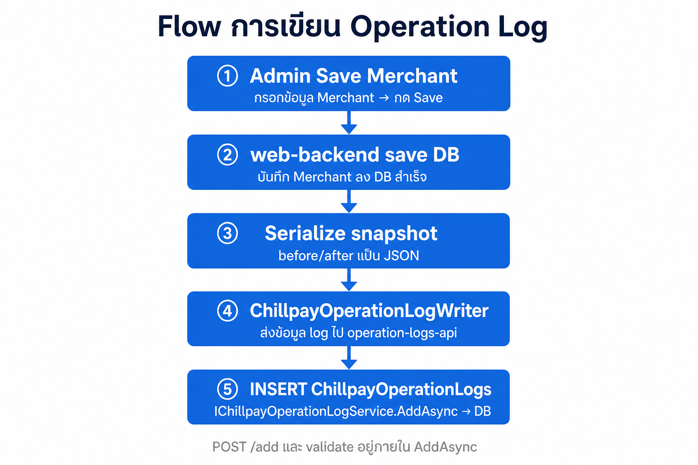
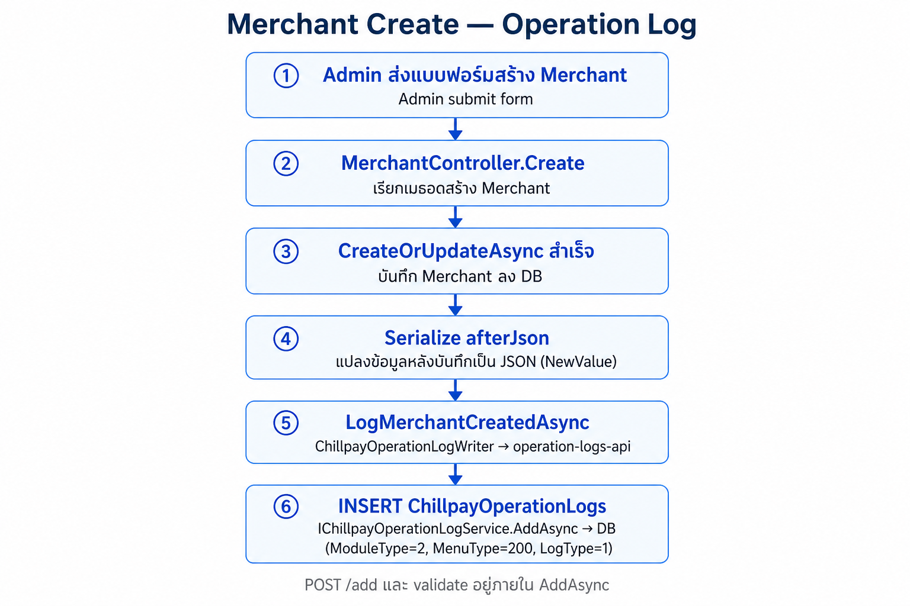
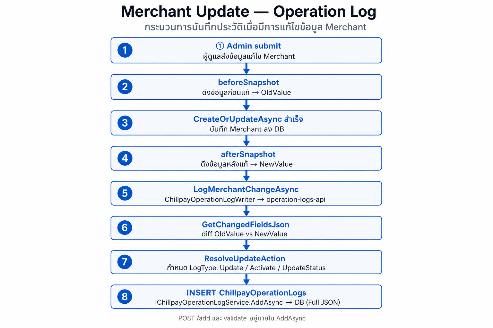
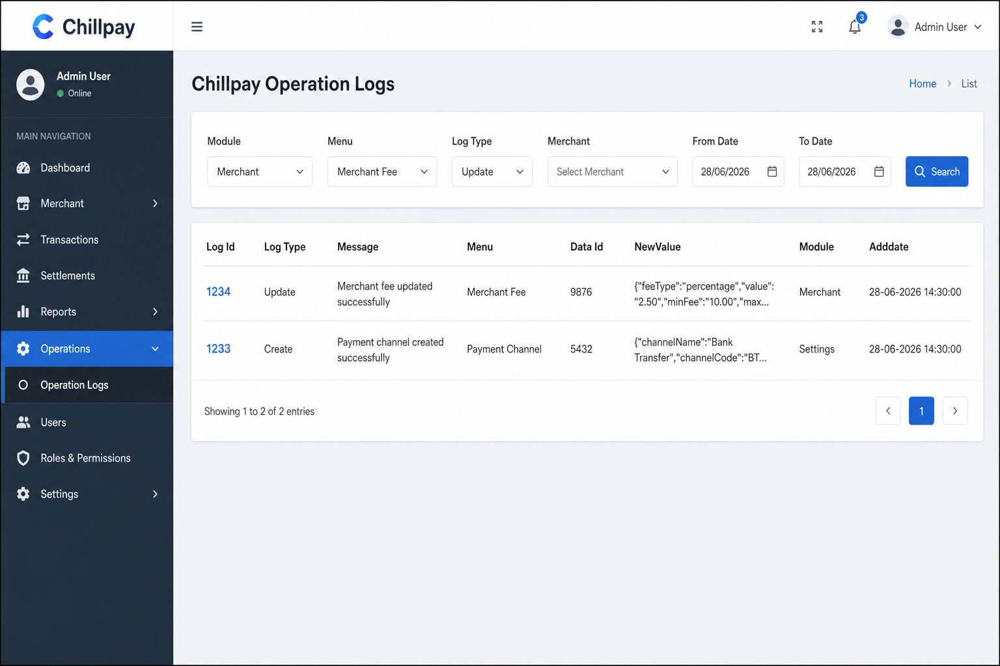
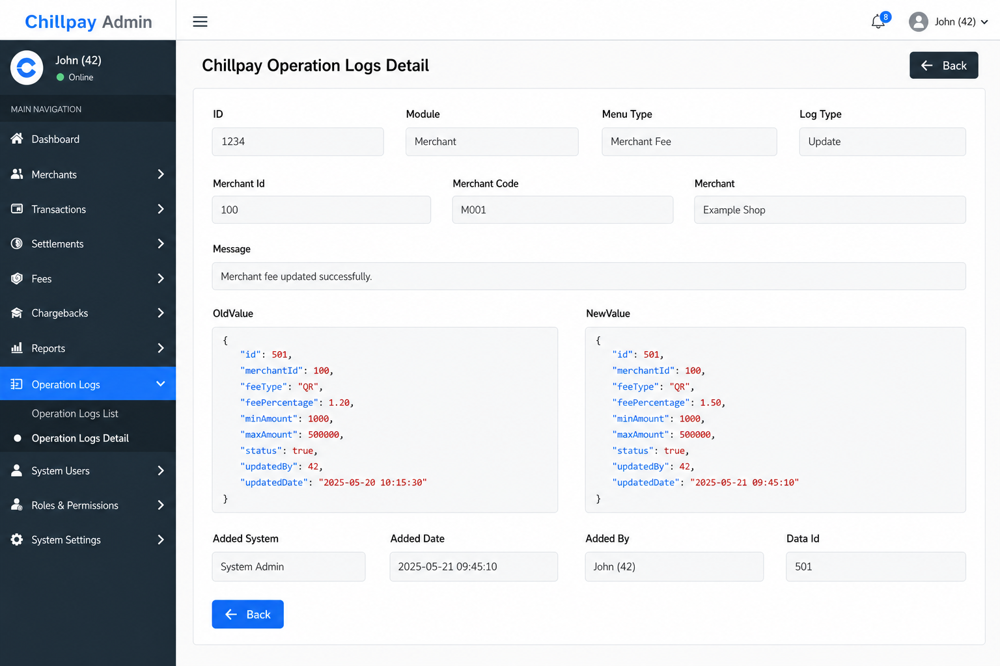

# Chillpay Operation Logs

> **เอกสารอ้างอิงหลัก** · รวม registry, UI, API, writer, **SQL script (Script)**  
> **สถานะ:** Phase 1 code พร้อม — รอ deploy + smoke test  
> **อัปเดต:** 2026-06-28  
> **ขอบเขต:** Admin UI (web-backend) + Operation Logs API + Registry Module 1–14

## สารบัญ

- [Summary](#summary)
- [Checklist](#checklist)
- [อธิบาย Registry — ModuleType, MenuType, LogType](#อธิบาย-registry--moduletype-menutype-logtype)
  - [ภาพรวม 3 ชั้น](#ภาพรวม-3-ชั้น)
  - [ModuleType](#moduletype--หมวดใหญ่-114)
  - [MenuType](#menutype--เมนูย่อยที่เขียน-log-ได้)
  - [LogType](#logtype--action-ประเภทการกระทำ)
  - [Flow การเขียน Log](#flow-การเขียน-log)
  - [ตัวอย่าง — Merchant Create](#ตัวอย่าง--merchant-create)
  - [ตัวอย่าง — Merchant Update](#ตัวอย่าง--merchant-update)
  - [ตัวอย่าง record — Merchant Fee Update](#ตัวอย่าง-record--merchant-fee-update)
- [UI](#ui)
  - [หน้า List](#หน้า-list--chillpay-operation-logs)
  - [หน้า Detail](#หน้า-detail--chillpay-operation-logs-detail)
- [API Design](#api-design)
- [Database](#database--schema-index-view-และ-deploy-script)
  - [ภาพรวม](#ภาพรวม)
  - [นโยบาย Writer](#นโยบาย-writer-ใช้งานจริง)
  - [ตาราง](#ตาราง-chillpayoperationlogs--คอลัมน์)
  - [Index และ View](#index-และ-view)
  - [Script](#script)
    - [ตาราง — ChillpayOperationLogs-Table.sql](#ตาราง--chillpayoperationlogs-tablesql)
    - [Index — ChillpayOperationLogs-Index.sql](#index--chillpayoperationlogs-indexsql)
    - [View — ChillpayOperationLogs-View.sql](#view--chillpayoperationlogs-viewsql)
- [โปรเจคที่เกี่ยวข้อง](#โปรเจคที่เกี่ยวข้อง)
  - [operation-logs-api (API)](#operation-logs-api-api)
  - [web-backend (Backend)](#web-backend-backend)
  - [web-frontend (Frontend)](#web-frontend-frontend)
  - [Chillpay database update](#chillpay-database-update)
- [Registry Sync (Manual)](#registry-sync-manual)
  - [แหล่งอ้างอิงหลัก](#แหล่งอ้างอิงหลัก--ไฟล์ต้นฉบับของ-registry)
  - [จุดที่ต้อง sync](#จุดที่ต้อง-sync)
  - [เพิ่ม MenuType ใหม่](#ขั้นตอนเมื่อเพิ่ม-menutype-ใหม่)
  - [Checklist PR](#checklist-สำหรับ-pr)
  - [sync ไม่ครบ](#ถ้า-sync-ไม่ครบ--อาการและวิธีแก้)
  - [เพิ่ม Module ใหม่](#การเพิ่ม-module-ใหม่)

---

## Summary

Chillpay Operation Logs เป็น **registry กลาง** สำหรับบันทึกการเปลี่ยนแปลงข้อมูลบน Web Admin แยกจาก PayOut โดยใช้โครงสร้าง **ModuleType → MenuType → LogType (Action) + DataId + MerchantId**

| หัวข้อ | สถานะ / แนวทาง |
|--------|----------------|
| โครงสร้าง Registry | **คง** Module / Menu / LogType — Writer ส่ง **MenuType + DataId** (+ **MerchantId** สำหรับ Module Merchant) |
| หน้า List | Browse ด้วย **Module + Menu + Log Type + Merchant + วันที่** |
| OldValue / NewValue (Update) | **snapshot JSON เต็ม** — diff ใช้เฉพาะตัดสิน Action type |
| **เมื่อไหร่เขียน Log** | **เฉพาะเมื่อรายการนั้น success** (Create/Update/Delete ผ่าน) — fail แล้วไม่เขียน |
| **MerchantId** | คอลัมน์ในตาราง + filter Search แบบ **PayOut** (`merchantId[]` + `LEFT JOIN Merchants`) |
| API | **Search** `POST /search` (List) · **Writer** `POST /add` · **Detail** `GET /{id}/{system}/{by}` — ดู API Design |

---

## Checklist

| # | งาน | Repo |
|---|-----|------|
| 1 | API Search / Add / FindById (.NET 8) | operation-logs-api |
| 2 | SQL `ChillpayOperationLogs` + view `VW_ChillpayOperationLogs` (script ใน Script) | Chillpay database update |
| 3 | Registry Module 1–14 (Merchant=2, Settings=3) | operation-logs-api + web-backend |
| 4 | Writer Merchant + Settings (บางเมนู) | web-backend |
| 5 | หน้า List `ChillpayOperationLogs.cshtml` | web-backend |
| 6 | หน้า Detail `ChillpayOperationLogsDetail.cshtml` — label **Merchant** (แทน Company Name) | web-backend |
| 7 | **Menu dropdown** บนหน้า List | web-backend |
| 8 | OldValue/NewValue ตอน Update = snapshot เต็ม | web-backend |
| 9 | `AjaxChillpayOperationLogsController` ส่ง `MerchantId[]` ไป API (แบบ PayOut) | web-backend |

---

## อธิบาย Registry — ModuleType, MenuType, LogType

### ภาพรวม 3 ชั้น

```
ModuleType (1–14)          ← หมวดใหญ่ = sidebar Admin (Merchant, Settings, …)
    └── MenuType           ← หน้าย่อยที่เขียน log ได้ (Fee, Route, Payment Channel, …)
            └── LogType    ← action ที่เกิดขึ้น (Create, Update, Delete, …)
                    └── DataId + MerchantId  ← id record + ร้าน (Module Merchant)
```

**ทำไมแยก 3 ชั้น?**

| ชั้น | ตอบคำถาม | ตัวอย่าง |
|------|----------|----------|
| **ModuleType** | log นี้อยู่ **หมวดไหน** ของ Admin? | 2 = Merchant |
| **MenuType** | log นี้มาจาก **หน้า/เมนูไหน**? | 202 = Merchant Fee |
| **LogType** | **ทำอะไร** กับ record นั้น? | 2 = Update |

แยกจาก PayOut ที่ใช้ LogType เป็นช่วงเลขแทน Menu — แบบ Chillpay map กับ sidebar Admin ได้ตรง

---

### ModuleType — หมวดใหญ่ (1–14)

`ModuleType` = ลำดับ module ตาม sidebar Web Admin — กำหนดใน enum `ChillpayOperationLogModuleType` (`OperationLogConstants.cs`)

```csharp
public enum ChillpayOperationLogModuleType
{
    User = 1,
    Merchant = 2,
    Settings = 3,
    Transactions = 4,
    Settlements = 5,
    ManageTransaction = 6,
    PayLink = 7,
    Fraud = 8,
    Etax = 9,
    OddService = 10,
    ChillAppPartner = 11,
    Wallet = 12,
    Recurring = 13,
    Commission = 14,
}
```

**บนหน้า List:** dropdown **Module** — เลือกหมวดเดียว หรือ Select All (ค้นทุก module ที่เปิดใช้)

---

### MenuType — เมนูย่อยที่เขียน log ได้

`MenuType` = หน้า Admin ที่มี operation log (create / update / delete ฯลฯ) — กำหนดใน enum `ChillpayOperationLogMenuType` (`OperationLogConstants.cs`)

```csharp
public enum ChillpayOperationLogMenuType
{
    // Module 1 — User
    Account = 101,
    Role = 102,

    // Module 2 — Merchant
    Merchant = 200,
    MerchantUser = 201,
    MerchantFee = 202,
    MerchantRoute = 203,
    MerchantServiceFee = 204,
    GenerateMerchantKeys = 205,
    MerchantEmails = 206,

    // Module 3 — Settings
    PaymentChannel = 300,
    PaymentRoute = 301,
    PaymentRouteInquiry = 302,
    CreditCardConfig = 303,
    SwitchPaymentRouteChannel = 305,
    ChillPayMaintenance = 306,
    BankMaintenance = 307,
    BankPaymentApiSetting = 308,
    SMSRoute = 309,
    ExchangeRate = 310,
    ExchangeRateLog = 311,

    // Module 4 — Transactions
    Payment = 401,
    Void = 402,
    RefundOld = 403,
    RefundTransaction = 404,
    ApproveRefund = 405,
    SettlementOld = 406,
    PaymentSummaryOld = 407,
    ImportMcc = 408,
    InquiryTransaction = 409,
    WarningTransaction = 410,

    // Module 5 — Settlements
    SettlementDashboard = 501,
    Settlement = 502,
    SettlementUploadFile = 503,
    SettlementMerchantTransfer = 504,
    SettlementMerchantSetting = 505,
    SettlementStatus = 506,
    DownloadPaymentSummary = 507,

    // Module 6 — Manage Transaction
    UpdateTransactionStatus = 601,
    UpdateSettlementStatus = 602,
    UpdateTransferDate = 603,

    // Module 7 — PayLink
    PayLinkLink = 701,
    PayLinkTransaction = 702,

    // Module 8 — Fraud
    FraudCreditCardTransactions = 801,
    FraudObserveConfiguration = 802,
    FraudObserveTransactions = 803,
    FraudAlertConfiguration = 804,
    FraudAlertTransactions = 805,

    // Module 9 — Etax
    EtaxMerchantProfile = 901,
    EtaxEndUserProfile = 902,
    EtaxSaleManage = 903,
    EtaxUploadSettlement = 904,
    EtaxUpdateSettlement = 905,
    EtaxSettlementPayOut = 906,
    EtaxInvoiceMerchant = 907,
    EtaxInvoiceEndUser = 908,
    EtaxInvoiceTransactions = 909,
    EtaxPnd = 910,
    EtaxInvoiceAbbTransactions = 911,
    EtaxOutstandingInvoice = 912,
    EtaxCancelInvoice = 913,
    EtaxCreditNote = 914,
    EtaxDebitNote = 915,
    EtaxCreditNoteInvAbb = 916,

    // Module 10 — Odd Service
    OddRoute = 1001,
    OddMerchantRoute = 1002,
    OddRegister = 1003,
    OddBayConfigs = 1004,
    OddBayCustomer = 1005,
    OddScbConfigs = 1006,
    OddScbCustomer = 1007,
    OddKtbConfigs = 1008,

    // Module 11 — Chill App Partner
    ChillAppMembers = 1101,
    ChillAppTransactions = 1102,
    ChillAppPartners = 1103,
    ChillAppPayTransactions = 1104,
    ChillAppSettlementPayTransactions = 1105,

    // Module 12 — Wallet
    WalletMerchant = 1201,
    WalletShopSendMoneyFee = 1202,
    WalletTransaction = 1203,
    WalletSettlementTransaction = 1204,
    WalletSettlementReport = 1205,
    WalletSettleVersion = 1206,

    // Module 13 — Recurring
    RecurringMerchant = 1301,
    RecurringSchedule = 1302,
    RecurringTransactions = 1303,

    // Module 14 — Commission
    CommissionReseller = 1401,
    CommissionResellerPayout = 1402,
    CommissionReports = 1403,
    CommissionDownloadReports = 1404,
}
```

**บนหน้า List:** dropdown **Menu** — แสดงเมื่อเลือก Module แล้ว; Select All = ไม่ส่ง `menuType` (ได้ทุกเมนูใน module)

---

### LogType — Action (ประเภทการกระทำ)

`LogType` = **action กลาง** ใช้ร่วมทุก module — ไม่ใช่ชื่อเมนู — กำหนดใน enum `ChillpayOperationLogActionType` (`OperationLogConstants.cs`)

```csharp
public enum ChillpayOperationLogActionType
{
    Create = 1,
    Update = 2,
    Activate = 3,
    Inactivate = 4,
    Delete = 5,
    Generate = 7,
    UpdateStatus = 8,
    Approve = 9,
    Reject = 10,
}
```

**บนหน้า List:** dropdown **Log Type** — filter ตาม action; รายการที่แสดงขึ้นกับ Menu ที่เลือก (แต่ละเมนูอนุญาต action ไม่เหมือนกัน เช่น Generate Keys มีแค่ action 7)

**การตัดสิน LogType ตอน Update (Writer):**

1. Serialize `beforeSnapshot` / `afterSnapshot` เต็ม
2. `GetChangedFieldsJson` → diff เฉพาะ field ที่เปลี่ยน
3. `ChillpayMerchantOperationLogResolver.ResolveUpdateAction(menuType, diff)` → เลือก Update / Activate / UpdateStatus
4. บันทึก log ด้วย snapshot เต็มใน OldValue/NewValue

**Merchant filter บนหน้า List:** `merchantId=[100]` — ดึง log ทุกเมนูของร้านนั้น (ใช้ index `IX_ChillpayOperationLogs_MerchantId` · แบบเดียวกับ PayOut `MerchantId.Contains`)

---

### Flow การเขียน Log

**กฎ:** บันทึก Operation Log **ต่อเมื่อรายการนั้น success เท่านั้น** — เรียก writer หลัง business action ผ่าน (เช่น `CreateOrUpdateAsync` คืน `Succeeded`)

| สถานการณ์ | เขียน Log? |
|-----------|------------|
| Save / Create / Update / Delete **ไม่สำเร็จ** | **ไม่** |
| Business action **สำเร็จ** | **ใช่** — เรียก `LogMerchantCreatedAsync`, `LogMerchantChangeAsync` ฯลฯ |
| Business สำเร็จ แต่เรียก operation-logs-api **ไม่ผ่าน** | business ยัง success — log อาจไม่เข้า DB |



> ขั้น `POST /add` และ validate เกิดภายใน `ChillpayOperationLogService.AddAsync` — ไม่แยกเป็น step ใน flow

- **LogAudit** แยกต่างหาก — เก็บเฉพาะ field ที่เปลี่ยน

**ไฟล์หลัก**

| Repo | บทบาท | ไฟล์ |
|------|--------|------|
| web-backend | Controller | `MerchantController.cs` — เรียก log หลัง save |
| web-backend | Helper | `BaseController.cs` — `LogMerchantCreatedAsync`, `LogMerchantChangeAsync` |
| web-backend | Writer | `ChillpayOperationLogWriter.cs` — `WriteMerchantLogAsync` → operation-logs-api |
| operation-logs-api | Service | `IChillpayOperationLogService` / `ChillpayOperationLogService.cs` — `AddAsync` (validate + INSERT) |

> **หมายเหตุ:** `ChillpayOperationLogWriter` (web-backend) เรียก API · `ChillpayOperationLogService` (operation-logs-api) รับ request แล้ว validate + บันทึกลง DB

---

### ตัวอย่าง — Merchant Create

**หน้า:** Merchant Create → กด Save (เฉพาะเมื่อ `CreateOrUpdateAsync` success)



> ขั้น `POST /add` และ validate เกิดภายใน `ChillpayOperationLogService.AddAsync` — ไม่แยกเป็น step ใน flow

**record ในตาราง `ChillpayOperationLogs` (ตัวอย่าง merchant id 100)**

| คอลัมน์ | ค่า |
|---------|-----|
| ModuleType | 2 (Merchant) |
| MenuType | 200 (Merchant) |
| LogType | 1 (Create) |
| DataId | 100 |
| MerchantId | 100 |
| OldValue | `null` |
| NewValue | JSON snapshot merchant ทั้งก้อนหลังสร้าง |
| Message | Merchant created |
| RequestSystem | Admin |
| RequestBy | user id ผู้สร้าง |

---

### ตัวอย่าง — Merchant Update

**หน้า:** Merchant Update → แก้ข้อมูล → กด Save (เฉพาะเมื่อ `CreateOrUpdateAsync` success)



> ขั้น `POST /add` และ validate เกิดภายใน `ChillpayOperationLogService.AddAsync` — ไม่แยกเป็น step ใน flow

**record ในตาราง (ตัวอย่าง แก้ CompanyName ของ merchant 100)**

| คอลัมน์ | ค่า |
|---------|-----|
| ModuleType | 2 |
| MenuType | 200 |
| LogType | 2 (Update) — หรือ 3/8 ถ้า resolver เห็นว่าเปลี่ยนแค่ status |
| DataId | 100 |
| MerchantId | 100 |
| OldValue | JSON snapshot merchant **ก่อน**แก้ |
| NewValue | JSON snapshot merchant **หลัง**แก้ |
| Message | Merchant updated |
| RequestSystem | Admin |

**อ่าน log กลับ:** หน้า List filter Module=Merchant, Merchant=100

---

### ตัวอย่าง record — Merchant Fee Update

แก้ Merchant Fee id **501** ของ merchant **100**:

| คอลัมน์ | ค่า |
|---------|-----|
| ModuleType | 2 |
| MenuType | 202 |
| LogType | 2 (Update) |
| DataId | 501 |
| MerchantId | 100 |
| OldValue | JSON snapshot เต็มก่อนแก้ |
| NewValue | JSON snapshot เต็มหลังแก้ |
| Message | Merchant fee updated |
| RequestSystem | Admin |
| RequestBy | user id |

---

## UI

### หน้า List — Chillpay Operation Logs

**Route:** `GET /OperationLog/ChillpayOperationLogs`



**คอลัมน์ตาราง:** Log Id, Log Type (ชื่อ action), Message, Menu (ชื่อเมนู), Data Id, NewValue (ย่อ), Module (ชื่อ module), Adddate

**พฤติกรรม Menu dropdown**

| Module ที่เลือก | Menu dropdown |
|----------------|---------------|
| Select All (0) | ซ่อน |
| Merchant (2) | Merchant, Fee, Route, Service Fee, Keys, Email, User |
| Settings (3) | Payment Channel, Route, Credit Card, … |

**พฤติกรรม Log Type dropdown**

- ใช้ `getChillpayOperationLogAllowedActions()` จาก `chillpay-operation-log-constants.js`
- ค่า allowed actions ต้องตรงกับ `GetAllowedActions()` ใน `ChillpayOperationLogRegistryConstants.cs`
- เมนูที่ไม่มีใน map (เช่น 302, 311) ใช้ **default** `[1,2,3,4,5,7,8]` (`ChillpayOperationLogDefaultMenuActions`)

**Ajax Search:** `POST /AjaxChillpayOperationLogs/Search` เท่านั้น (ลบ `SearchMerchant` / `SearchSettings` แล้ว)

**แทน Exchange Rate Logs (เมนูเดิม):** ไม่ใช้ `/ExchangeRateLog` + ตาราง `ExchangeRateLogs` สำหรับ log ใหม่ — filter หน้านี้ด้วย Module **Settings** · Menu **Exchange Rate** · **Data Id** (เทียบ `ExchangeRateId` เดิม) · Log Type · วันที่

---

### หน้า Detail — Chillpay Operation Logs Detail

**Route:** `GET /OperationLog/ChillpayOperationLogsDetail/{id}`

**ปุ่ม Back:** มุมขวาบน (dark) และล่างซ้าย (primary) — กลับหน้า List (`/OperationLog/ChillpayOperationLogs`)



แสดง read-only: ID, Module, **Menu Type**, **Merchant** (ถ้า module 2), Log Type, Message, **OldValue / NewValue**, Added System/Date/By, **Data Id**

---

## API Design

Base path: `/api/v1/chillpayoperationlogs`

| Method | Route | ใช้เมื่อ |
|--------|-------|----------|
| POST | `/search` | **หน้า List** — filter Module / Menu / LogType / Merchant / วันที่ |
| GET | `/{id}/{system}/{by}` | **หน้า Detail** — อ่าน log ตาม id |
| POST | `/add` | **Writer** — web-backend บันทึก log หลัง business success |

**Search parameters หลัก** (`POST /search`)

| Parameter | หมายเหตุ |
|-----------|----------|
| `moduleType[]` | หมวดใหญ่ |
| `menuType[]` | เมนูย่อย — **ใหม่ใน UI** |
| `logType[]` | action (Create/Update/…) |
| `merchantId[]` | **Merchant filter** — แบบ PayOut (`WHERE MerchantId IN (...)`) |
| `dataId` | id record — filter ตาม record (เช่น Exchange Rate id) |
| `refType[]` + `refId` | *(legacy / optional)* — log เก่าหรือ integration · Phase 1 List ใช้ `menuType[]` + `dataId` แทน |
| `addedDateFrom/To` | default วันนี้ |
| `searchText` | keyword (LIKE) |

**Detail parameters** (`GET /{id}/{system}/{by}`) — path parameters

| Parameter | ชนิด | หมายเหตุ |
|-----------|------|----------|
| `id` | long | Log Id จากหน้า List |
| `system` | string | ระบบที่เรียก — `Admin`, `Backend`, `API`, `Job`, `MerchantApi` |
| `by` | long | user id ผู้เรียกดู (ต้อง &gt; 0) |

ตัวอย่าง: `GET /api/v1/chillpayoperationlogs/1234/Admin/42`

**Response:** record จาก `VW_ChillpayOperationLogs` — หน้า Detail bind **Merchant** จาก `CompanyName` (+ `MerchantCode` ฯลฯ)

**Add parameters หลัก** (`POST /add`)

| Parameter | หมายเหตุ |
|-----------|----------|
| `moduleType`, `menuType`, `logType` | registry — **บังคับ** |
| **`dataId`** | id record ที่ถูก action — **บังคับ** (เทียบ `ExchangeRateId`) |
| **`merchantId`** | id ร้าน — **Module Merchant เท่านั้น** |
| `oldValue`, `newValue`, `message` | snapshot + ข้อความ |
| `requestSystem`, `requestBy` | ผู้เขียน log |
| `refType`, `refId`, `ref2Type`, `ref2Id` | *(Phase 1 ไม่ส่ง — `NULL` ใน DB)* · คอลัมน์ nullable รองรับ log เก่า / อนาคต |

---

## Database — Schema, Index, View และ Deploy Script

### ภาพรวม

| Object | ชื่อ | ใช้เมื่อ |
|--------|------|----------|
| **ตาราง** | `ChillpayOperationLogs` | API **INSERT** ตอน Writer เรียก `POST /add` — มีคอลัมน์ **`MerchantId`** แบบ PayOut |
| **View** | `VW_ChillpayOperationLogs` | API **SELECT** ตอน Search / FindById — `LEFT JOIN Merchants` บน `b.MerchantId` |
| **Index** | 5 ตัว | Browse (Module+Menu), LogType, DataId, MerchantId · Ref (legacy) |

```
Writer (web-backend)  →  INSERT ChillpayOperationLogs (รวม MerchantId)
Admin List/Detail     →  SELECT VW_ChillpayOperationLogs
                        →  filter ร้าน: WHERE MerchantId IN (...)
```

**Prerequisite:** ตาราง `[dbo].[Merchants]` ต้องมีอยู่แล้วใน DB เดียวกัน — View join เพื่อแสดง MerchantCode, CompanyName บนหน้า List

### นโยบาย Writer (Phase 1)

สำหรับ **web-backend Writer** ตอน `POST /add` — อ้างอิงรูปแบบเก็บข้อมูลจาก **`ExchangeRateLogs`** แล้วขยายด้วย **ModuleType / MenuType** · **ไม่ส่ง Ref\*** (`NULL` ใน DB)

#### Map จาก `ExchangeRateLogs` → `ChillpayOperationLogs`

| `ExchangeRateLogs` | `ChillpayOperationLogs` | หมายเหตุ |
|--------------------|-------------------------|----------|
| `Id` | `Id` | IDENTITY |
| `LogType` | `LogType` | registry กลาง — Delete ใช้ **5** (ไม่ใช่ 3 แบบตารางเดิม) |
| `Message` | `Message` | เช่น "Exchange rate updated" |
| `ExchangeRateId` | **`DataId`** | id record เดียวกัน |
| `OldValue` | `OldValue` | JSON snapshot ก่อน action |
| `NewValue` | `NewValue` | JSON snapshot หลัง action |
| `AddedDate` | `AddedDate` | default `GETDATE()` |
| `AddedBy` | **`RequestBy`** | user id ผู้กระทำ |
| *(ไม่มี)* | **`ModuleType`** | `3` = Settings |
| *(ไม่มี)* | **`MenuType`** | `310` = Exchange Rate |
| *(ไม่มี)* | **`RequestSystem`** | `Admin` |
| *(ไม่มี)* | **`MerchantId`** | `NULL` (นอก Module Merchant) |
| *(ไม่มี)* | **`RefType` / `RefId` / `Ref2*`** | `NULL` (Phase 1) |

**Writer** (`WriteMerchantLogAsync` / `WriteSettingsLogAsync` / `LogSettings*Async`): ส่ง `moduleType`, `menuType`, `logType`, **`dataId`**, `oldValue`, `newValue`, `message`, `requestBy`, `requestSystem` · **`merchantId`** เมื่อ Module Merchant

| ฟิลด์ | Writer ส่ง (Phase 1) |
|--------|----------------------|
| **ModuleType / MenuType** | **ใช่** — registry |
| **DataId** | **ใช่** — id record (เทียบ `ExchangeRateId`) |
| **MerchantId** | Module Merchant **เท่านั้น** |
| **RefType / RefId / Ref2\*** | **ไม่ส่ง** (`NULL`) |

| สถานการณ์ | MenuType | DataId | MerchantId | Ref\* ใน DB |
|-----------|----------|--------|------------|-------------|
| สร้าง / แก้ Merchant ร้าน 100 | 200 | 100 | 100 | `NULL` |
| แก้ Merchant Fee id 501 ร้าน 100 | 202 | 501 | 100 | `NULL` |
| แก้ Payment Channel (Settings) | 300 | 7 | *(ไม่ส่ง)* | `NULL` |
| แก้ Exchange Rate id 7 (Settings) | 310 | 7 | *(ไม่ส่ง)* | `NULL` |

> **กฎง่าย:** `menuType` + `dataId` (+ `merchantId` ถ้า Module Merchant) — ชนิด entity อ่านจาก **MenuType** ไม่ต้องส่ง RefType แยก

```
แก้ Exchange Rate id 7 (เทียบ ExchangeRateLogs):
  ModuleType = 3
  MenuType   = 310
  LogType    = 2 (Update)
  Message    = Exchange rate updated
  DataId     = 7          ← ExchangeRateId
  OldValue   = { ... }
  NewValue   = { ... }
  RequestBy  = user id    ← AddedBy
  RequestSystem = Admin
  MerchantId = NULL
  RefType / RefId / Ref2* = NULL
```

**`POST /add` — web-backend ส่ง (Phase 1)**

- `moduleType`, `menuType`, `logType`
- **`dataId`**
- **`merchantId`** (Module Merchant)
- `oldValue`, `newValue`, `message`, `requestSystem`, `requestBy`

**ตัวอย่าง Merchant Fee Update** (fee 501, ร้าน 100)

| คอลัมน์ | Writer ส่ง | ใน DB |
|---------|------------|-------|
| MenuType | 202 | 202 |
| DataId | 501 | 501 |
| MerchantId | 100 | 100 |

**ตัวอย่าง Exchange Rate Update** (Settings — แทน `ExchangeRateLogs`)

Writer: **web-backend** (`ExchangeRateController` → `LogSettings*Async`) หลัง admin-api CRUD สำเร็จ

| คอลัมน์ | ใน DB | `ExchangeRateLogs` เดิม |
|---------|-------|-------------------------|
| ModuleType / MenuType | 3 / 310 | — |
| DataId | 7 | `ExchangeRateId = 7` |
| LogType | 2 (Update) | 2 — Delete ใช้ **5** |
| OldValue / NewValue | JSON เต็ม | เหมือนกัน |
| RequestBy | user id | `AddedBy` |
| Ref\* / MerchantId | `NULL` | — |

**อ่าน log (แทน `/ExchangeRateLog`):** List กลาง → Module **Settings (3)** · Menu **Exchange Rate (310)** · **Data Id** = exchange rate id

**Detail:** Data Id ลิงก์ไป `/ExchangeRate/Update/{dataId}`

Writer **ส่ง `merchantId` เอง** สำหรับ Module Merchant — `ResolveMerchantId()` เป็น fallback จาก `DataId` / `MenuType` เมื่อ Writer ไม่ส่ง

### ตาราง `ChillpayOperationLogs` — คอลัมน์

| คอลัมน์ | ชนิด | คำอธิบาย |
|---------|------|----------|
| **Id** | bigint IDENTITY | PK — log id (แสดงบนหน้า List/Detail) |
| **ModuleType** | int | หมวดใหญ่ registry (ModuleType) เช่น 2=Merchant, 3=Settings |
| **MenuType** | int | เมนูย่อย (MenuType) เช่น 202=Merchant Fee |
| **LogType** | int | action (LogType) เช่น 1=Create, 2=Update, 5=Delete |
| **Message** | nvarchar(500) | ข้อความสรุป เช่น "Merchant fee updated" |
| **OldValue** | nvarchar(max) | JSON snapshot ก่อน action — null ตอน Create |
| **NewValue** | nvarchar(max) | JSON snapshot หลัง action — null ตอน Delete |
| **DataId** | bigint | id ของ record ที่ถูก action — เทียบ `ExchangeRateId` · อ่านคู่ **MenuType** |
| **RefType** | int | *(legacy / Phase 1 = `NULL`)* — ชนิด entity รุ่นก่อน |
| **RefId** | bigint | *(legacy / Phase 1 = `NULL`)* |
| **Ref2Type** | int | *(legacy / Phase 1 = `NULL`)* |
| **Ref2Id** | bigint | *(legacy / Phase 1 = `NULL`)* |
| **MerchantId** | bigint | id ร้านค้า — เก็บตอน INSERT แยกต่างหาก · ใช้ filter List แบบ PayOut · `NULL` นอก Module Merchant |
| **RequestSystem** | nvarchar(20) | ระบบที่เขียน log: Admin, Backend, API, Job, MerchantApi |
| **RequestBy** | bigint | user id ผู้กระทำ |
| **RequestByName** | nvarchar(200) | ชื่อแสดงผู้กระทำ (optional) |
| **AddedDate** | datetime | วันเวลาบันทึก (default GETDATE()) |

คอลัมน์ **Ref\*** ยังอยู่ใน schema (`nullable`) — Phase 1 Writer **ไม่ populate** · log เก่าที่มีค่าอาจยังแสดงใน View `*Text`

### Index และ View

**Index**

| Index | คอลัมน์ | รองรับ query |
|-------|--------|--------------|
| `PK_ChillpayOperationLogs` | Id | Detail by id |
| `IX_ChillpayOperationLogs_Module_Menu` | ModuleType, MenuType, AddedDate DESC | **Browse หลัก** — filter Module + Menu + เรียงวันที่ |
| `IX_ChillpayOperationLogs_LogType` | LogType, AddedDate DESC | filter Action (Create/Update/…) |
| `IX_ChillpayOperationLogs_DataId` | DataId (filtered) | filter ตาม record id (API — UI ไม่ใช้ deep link) |
| `IX_ChillpayOperationLogs_RefType_RefId` | RefType, RefId (filtered) | *(legacy)* — log เก่า / integration |
| `IX_ChillpayOperationLogs_MerchantId` | MerchantId (filtered) | Merchant filter ตรง — แบบเดียวกับ PayOut |

**Query pattern ตัวอย่าง**

```sql
WHERE ModuleType IN (2)
  AND MenuType IN (202)
  AND DataId = 501
  AND MerchantId = 100
```

**View `VW_ChillpayOperationLogs`**

| ส่วน | คำอธิบาย |
|------|----------|
| คอลัมน์จากตาราง | `SELECT b.*` — ทุก column ของ `ChillpayOperationLogs` (แบบ PayOut) |
| `AddedDateText` | `dd-MM-yyyy HH:mm:ss` (style 105 + 8 — แบบ PayOut) |
| `ModuleTypeText` | ชื่อ module จาก CASE |
| `MenuTypeText` | ชื่อเมนูจาก CASE (ตรง registry Module 1–14) |
| `LogTypeText` | ชื่อ action จาก CASE (Create, Update, …) |
| `RefTypeText` / `Ref2TypeText` | ชื่อ entity จาก CASE — ว่างเมื่อ Ref\* เป็น `NULL` (Phase 1) |
| `MerchantCode`, `CompanyName`, … | `LEFT JOIN Merchants` บน `b.MerchantId` |

**Index อนาคต (Phase 3 ถ้าช้า):** `(Ref2Type, Ref2Id)` filtered, full-text บน Message

### Script

Generate: `python docs/extract-sql.py`

| ลำดับ | ไฟล์ | รันเมื่อ |
|------|------|----------|
| 1 | [`ChillpayOperationLogs-Table.sql`](sql/ChillpayOperationLogs-Table.sql) | สร้างตาราง + `MerchantId` + backfill (ครั้งแรก / migrate) |
| 2 | [`ChillpayOperationLogs-Index.sql`](sql/ChillpayOperationLogs-Index.sql) | สร้าง index บนตาราง |
| 3 | [`ChillpayOperationLogs-View.sql`](sql/ChillpayOperationLogs-View.sql) | สร้าง/อัปเดต View `*Text` (รันบ่อยเมื่อเพิ่ม Menu/Module/Log) |

> ต้องมีตาราง `[dbo].[Merchants]` อยู่แล้วก่อนรัน View

#### ตาราง — `ChillpayOperationLogs-Table.sql`

```sql
/*
  Chillpay Operation Logs — Table + MerchantId migrate
  เอกสาร: docs/Chillpay-Operation-Logs.md Table script
*/
SET ANSI_NULLS ON;
GO
SET QUOTED_IDENTIFIER ON;
GO

IF NOT EXISTS (SELECT 1 FROM sys.tables WHERE name = 'ChillpayOperationLogs')
BEGIN
    CREATE TABLE [dbo].[ChillpayOperationLogs](
        [Id]              [bigint] IDENTITY(1,1) NOT NULL,
        [ModuleType]      [int] NOT NULL,
        [MenuType]        [int] NOT NULL,
        [LogType]         [int] NOT NULL,
        [Message]         [nvarchar](500) NULL,
        [OldValue]        [nvarchar](max) NULL,
        [NewValue]        [nvarchar](max) NULL,
        [DataId]          [bigint] NULL,
        [RefType]         [int] NULL,
        [RefId]           [bigint] NULL,
        [Ref2Type]        [int] NULL,
        [Ref2Id]          [bigint] NULL,
        [MerchantId]      [bigint] NULL,
        [RequestSystem]   [nvarchar](20) NOT NULL,
        [RequestBy]       [bigint] NOT NULL,
        [RequestByName]   [nvarchar](200) NULL,
        [AddedDate]       [datetime] NOT NULL CONSTRAINT [DF_ChillpayOperationLogs_AddedDate] DEFAULT (GETDATE()),
        CONSTRAINT [PK_ChillpayOperationLogs] PRIMARY KEY CLUSTERED ([Id] ASC)
    ) ON [PRIMARY] TEXTIMAGE_ON [PRIMARY];
END
GO

IF NOT EXISTS (SELECT 1 FROM sys.columns WHERE object_id = OBJECT_ID('dbo.ChillpayOperationLogs') AND name = 'MerchantId')
BEGIN
    ALTER TABLE [dbo].[ChillpayOperationLogs] ADD [MerchantId] [bigint] NULL;
END
GO

-- backfill MerchantId สำหรับ row เก่า (Module Merchant)
UPDATE [dbo].[ChillpayOperationLogs]
SET [MerchantId] = COALESCE(
        CASE WHEN [RefType] = 20000 THEN [RefId] END,
        CASE WHEN [Ref2Type] = 20000 THEN [Ref2Id] END,
        CASE WHEN [MenuType] = 200 THEN [DataId] END
    )
WHERE [ModuleType] = 2
  AND [MerchantId] IS NULL;
GO
```

#### Index — `ChillpayOperationLogs-Index.sql`

```sql
/*
  Chillpay Operation Logs — Indexes
  เอกสาร: docs/Chillpay-Operation-Logs.md Index script
  ต้องรัน Table script ก่อน
*/
SET ANSI_NULLS ON;
GO
SET QUOTED_IDENTIFIER ON;
GO

IF NOT EXISTS (SELECT 1 FROM sys.indexes WHERE name = 'IX_ChillpayOperationLogs_Module_Menu' AND object_id = OBJECT_ID('dbo.ChillpayOperationLogs'))
BEGIN
    CREATE NONCLUSTERED INDEX [IX_ChillpayOperationLogs_Module_Menu]
        ON [dbo].[ChillpayOperationLogs]([ModuleType] ASC, [MenuType] ASC, [AddedDate] DESC);
END
GO

IF NOT EXISTS (SELECT 1 FROM sys.indexes WHERE name = 'IX_ChillpayOperationLogs_LogType' AND object_id = OBJECT_ID('dbo.ChillpayOperationLogs'))
BEGIN
    CREATE NONCLUSTERED INDEX [IX_ChillpayOperationLogs_LogType]
        ON [dbo].[ChillpayOperationLogs]([LogType] ASC, [AddedDate] DESC);
END
GO

IF NOT EXISTS (SELECT 1 FROM sys.indexes WHERE name = 'IX_ChillpayOperationLogs_DataId' AND object_id = OBJECT_ID('dbo.ChillpayOperationLogs'))
BEGIN
    CREATE NONCLUSTERED INDEX [IX_ChillpayOperationLogs_DataId]
        ON [dbo].[ChillpayOperationLogs]([DataId] ASC)
        WHERE [DataId] IS NOT NULL;
END
GO

IF NOT EXISTS (SELECT 1 FROM sys.indexes WHERE name = 'IX_ChillpayOperationLogs_RefType_RefId' AND object_id = OBJECT_ID('dbo.ChillpayOperationLogs'))
BEGIN
    CREATE NONCLUSTERED INDEX [IX_ChillpayOperationLogs_RefType_RefId]
        ON [dbo].[ChillpayOperationLogs]([RefType] ASC, [RefId] ASC)
        WHERE [RefType] IS NOT NULL AND [RefId] IS NOT NULL;
END
GO

IF NOT EXISTS (SELECT 1 FROM sys.indexes WHERE name = 'IX_ChillpayOperationLogs_MerchantId' AND object_id = OBJECT_ID('dbo.ChillpayOperationLogs'))
BEGIN
    CREATE NONCLUSTERED INDEX [IX_ChillpayOperationLogs_MerchantId]
        ON [dbo].[ChillpayOperationLogs]([MerchantId] ASC)
        WHERE [MerchantId] IS NOT NULL;
END
GO
```

#### View — `ChillpayOperationLogs-View.sql`

```sql
/*
  Chillpay Operation Logs — View VW_ChillpayOperationLogs
  เอกสาร: docs/Chillpay-Operation-Logs.md View script
  ต้องมีตาราง ChillpayOperationLogs + Merchants ก่อนรัน
*/
SET ANSI_NULLS ON;
GO
SET QUOTED_IDENTIFIER ON;
GO

CREATE OR ALTER VIEW [dbo].[VW_ChillpayOperationLogs]
AS
SELECT b.*
    , (CONVERT(varchar(10), b.[AddedDate], 105) + N' ' + CONVERT(varchar(8), b.[AddedDate], 8)) AS [AddedDateText]
    , (CASE b.[ModuleType]
        WHEN 1 THEN N'User'
        WHEN 2 THEN N'Merchant'
        WHEN 3 THEN N'Settings'
        WHEN 4 THEN N'Transactions'
        WHEN 5 THEN N'Settlements'
        WHEN 6 THEN N'Manage Transaction'
        WHEN 7 THEN N'PayLink'
        WHEN 8 THEN N'Fraud'
        WHEN 9 THEN N'Etax'
        WHEN 10 THEN N'Odd Service'
        WHEN 11 THEN N'Chill App Partner'
        WHEN 12 THEN N'Wallet'
        WHEN 13 THEN N'Recurring'
        WHEN 14 THEN N'Commission'
        ELSE CAST(b.[ModuleType] AS nvarchar(20))
      END) AS [ModuleTypeText]
    , (CASE b.[MenuType]
        WHEN 101 THEN N'Account'
        WHEN 102 THEN N'Role'
        WHEN 200 THEN N'Merchant'
        WHEN 201 THEN N'Merchant User'
        WHEN 202 THEN N'Merchant Fee'
        WHEN 203 THEN N'Merchant Route'
        WHEN 204 THEN N'Merchant Service Fee'
        WHEN 205 THEN N'Generate Merchant Keys'
        WHEN 206 THEN N'Merchant Emails'
        WHEN 300 THEN N'Payment Channel'
        WHEN 301 THEN N'Payment Route'
        WHEN 302 THEN N'Payment Route Inquiry'
        WHEN 303 THEN N'Credit Card Config'
        WHEN 305 THEN N'Switch Payment Route Channel'
        WHEN 306 THEN N'ChillPay Maintenance'
        WHEN 307 THEN N'Bank Maintenance'
        WHEN 308 THEN N'Bank Payment Api Setting'
        WHEN 309 THEN N'SMS Route'
        WHEN 310 THEN N'Exchange Rate'
        WHEN 311 THEN N'Exchange Rate Log'
        WHEN 401 THEN N'Payment'
        WHEN 402 THEN N'Void'
        WHEN 403 THEN N'Refund (Old)'
        WHEN 404 THEN N'Refund Transaction'
        WHEN 405 THEN N'Approve Refund'
        WHEN 406 THEN N'Settlement (Old)'
        WHEN 407 THEN N'Payment Summary (Old)'
        WHEN 408 THEN N'Import MCC'
        WHEN 409 THEN N'Inquiry Transaction'
        WHEN 410 THEN N'Warning Transaction'
        WHEN 501 THEN N'Settlement Dashboard'
        WHEN 502 THEN N'Settlement'
        WHEN 503 THEN N'Upload File'
        WHEN 504 THEN N'Merchant Transfer'
        WHEN 505 THEN N'Merchant Setting'
        WHEN 506 THEN N'Settlement Status'
        WHEN 507 THEN N'Download Payment Summary'
        WHEN 601 THEN N'Update Transaction Status'
        WHEN 602 THEN N'Update Settlement Status'
        WHEN 603 THEN N'Update Transfer Date'
        WHEN 701 THEN N'PayLink Link'
        WHEN 702 THEN N'PayLink Transaction'
        WHEN 801 THEN N'CreditCard Transactions'
        WHEN 802 THEN N'Observe Configuration'
        WHEN 803 THEN N'Observe Transactions'
        WHEN 804 THEN N'FraudAlert Configuration'
        WHEN 805 THEN N'FraudAlert Transactions'
        WHEN 901 THEN N'Etax Merchant Profile'
        WHEN 902 THEN N'Etax EndUser Profile'
        WHEN 903 THEN N'Sale Name Manage'
        WHEN 904 THEN N'Upload Summary Settlement'
        WHEN 905 THEN N'Update Summary Settlement'
        WHEN 906 THEN N'Settlement PayOut'
        WHEN 907 THEN N'Invoice Merchant'
        WHEN 908 THEN N'Invoice EndUser'
        WHEN 909 THEN N'Invoice Transaction'
        WHEN 910 THEN N'PND'
        WHEN 911 THEN N'Invoice ABB Transaction'
        WHEN 912 THEN N'Outstanding Invoice'
        WHEN 913 THEN N'Cancel Invoice'
        WHEN 914 THEN N'Credit Note'
        WHEN 915 THEN N'Debit Note'
        WHEN 916 THEN N'CreditNote Invoice ABB'
        WHEN 1001 THEN N'ODD Route'
        WHEN 1002 THEN N'ODD Merchant Route'
        WHEN 1003 THEN N'ODD Register'
        WHEN 1004 THEN N'ODD BAY Configs'
        WHEN 1005 THEN N'ODD BAY Customer'
        WHEN 1006 THEN N'ODD SCB Configs'
        WHEN 1007 THEN N'ODD SCB Customer'
        WHEN 1008 THEN N'ODD KTB Configs'
        WHEN 1101 THEN N'Chill App Members'
        WHEN 1102 THEN N'Chill App Transactions'
        WHEN 1103 THEN N'Chill App Partners'
        WHEN 1104 THEN N'Chill App PayTransactions'
        WHEN 1105 THEN N'Chill App Settlement PayTransactions'
        WHEN 1201 THEN N'Wallet Merchant'
        WHEN 1202 THEN N'Shop Send Money Fee'
        WHEN 1203 THEN N'Wallet Transaction'
        WHEN 1204 THEN N'Wallet Settlement Transaction'
        WHEN 1205 THEN N'Wallet Settlement Report'
        WHEN 1206 THEN N'Settle Version'
        WHEN 1301 THEN N'Recurring Merchant'
        WHEN 1302 THEN N'Recurring Schedule'
        WHEN 1303 THEN N'Recurring Transactions'
        WHEN 1401 THEN N'Commission Reseller'
        WHEN 1402 THEN N'Commission Reseller Payout'
        WHEN 1403 THEN N'Commission Reports'
        WHEN 1404 THEN N'Commission Download Reports'
        ELSE CAST(b.[MenuType] AS nvarchar(20))
      END) AS [MenuTypeText]
    , (CASE b.[LogType]
        WHEN 1 THEN N'Create'
        WHEN 2 THEN N'Update'
        WHEN 3 THEN N'Activate'
        WHEN 4 THEN N'Inactivate'
        WHEN 5 THEN N'Delete'
        WHEN 7 THEN N'Generate'
        WHEN 8 THEN N'UpdateStatus'
        WHEN 9 THEN N'Approve'
        WHEN 10 THEN N'Reject'
        ELSE CAST(b.[LogType] AS nvarchar(20))
      END) AS [LogTypeText]
    , (CASE WHEN b.[RefType] IS NULL THEN N''
        ELSE CASE b.[RefType]
            WHEN 0 THEN N'Undefined'
            WHEN 20000 THEN N'Merchant'
            WHEN 20001 THEN N'Merchant User'
            WHEN 20002 THEN N'Merchant Fee'
            WHEN 20003 THEN N'Merchant Route'
            WHEN 20004 THEN N'Merchant Service Fee'
            WHEN 20005 THEN N'Merchant Email'
            WHEN 30000 THEN N'Payment Channel'
            WHEN 30001 THEN N'Payment Route'
            WHEN 30002 THEN N'Payment Route Inquiry'
            WHEN 30003 THEN N'Credit Card Config'
            WHEN 30004 THEN N'ChillPay Maintenance'
            WHEN 30005 THEN N'Bank Maintenance'
            WHEN 30006 THEN N'Bank Payment Api Setting'
            WHEN 30007 THEN N'SMS Route'
            WHEN 30008 THEN N'Exchange Rate'
            WHEN 30009 THEN N'Exchange Rate Log'
            WHEN 10001 THEN N'Account'
            WHEN 10002 THEN N'Role'
            WHEN 40000 THEN N'Payment Transaction'
            WHEN 50000 THEN N'Settlement Record'
            WHEN 60000 THEN N'Managed Transaction'
            WHEN 70000 THEN N'PayLink Record'
            WHEN 80000 THEN N'Fraud Record'
            WHEN 90000 THEN N'Etax Record'
            WHEN 100000 THEN N'Odd Record'
            WHEN 110000 THEN N'Chill App Record'
            WHEN 120000 THEN N'Wallet Record'
            WHEN 130000 THEN N'Recurring Record'
            WHEN 140000 THEN N'Commission Record'
            ELSE CAST(b.[RefType] AS nvarchar(20))
        END
      END) AS [RefTypeText]
    , (CASE WHEN b.[Ref2Type] IS NULL THEN N''
        ELSE CASE b.[Ref2Type]
            WHEN 0 THEN N'Undefined'
            WHEN 20000 THEN N'Merchant'
            WHEN 20001 THEN N'Merchant User'
            WHEN 20002 THEN N'Merchant Fee'
            WHEN 20003 THEN N'Merchant Route'
            WHEN 20004 THEN N'Merchant Service Fee'
            WHEN 20005 THEN N'Merchant Email'
            WHEN 30000 THEN N'Payment Channel'
            WHEN 30001 THEN N'Payment Route'
            WHEN 30002 THEN N'Payment Route Inquiry'
            WHEN 30003 THEN N'Credit Card Config'
            WHEN 30004 THEN N'ChillPay Maintenance'
            WHEN 30005 THEN N'Bank Maintenance'
            WHEN 30006 THEN N'Bank Payment Api Setting'
            WHEN 30007 THEN N'SMS Route'
            WHEN 30008 THEN N'Exchange Rate'
            WHEN 30009 THEN N'Exchange Rate Log'
            WHEN 10001 THEN N'Account'
            WHEN 10002 THEN N'Role'
            WHEN 40000 THEN N'Payment Transaction'
            WHEN 50000 THEN N'Settlement Record'
            WHEN 60000 THEN N'Managed Transaction'
            WHEN 70000 THEN N'PayLink Record'
            WHEN 80000 THEN N'Fraud Record'
            WHEN 90000 THEN N'Etax Record'
            WHEN 100000 THEN N'Odd Record'
            WHEN 110000 THEN N'Chill App Record'
            WHEN 120000 THEN N'Wallet Record'
            WHEN 130000 THEN N'Recurring Record'
            WHEN 140000 THEN N'Commission Record'
            ELSE CAST(b.[Ref2Type] AS nvarchar(20))
        END
      END) AS [Ref2TypeText]
    , m.[MerchantCode], m.[ShortName], m.[CompanyName], m.[ShortNameEN]
FROM [dbo].[ChillpayOperationLogs] AS b WITH (NOLOCK)
LEFT OUTER JOIN [dbo].[Merchants] AS m WITH (NOLOCK) ON b.[MerchantId] = m.[Id];
GO
```

---

## โปรเจคที่เกี่ยวข้อง

### operation-logs-api (API)

| ไฟล์ | หมายเหตุ |
|------|----------|
| `OperationLogConstants.cs` | **ต้นฉบับ** enum + validate + `ResolveMerchantId` + `AllModuleTypes` |
| `ChillpayOperationLogController.cs` | API endpoints — `POST /search`, `GET /{id}`, `POST /add` |
| `ChillpayOperationLogService.cs` | business logic — Search, FindById, AddAsync |
| `ChillpayOperationLogRepository.cs` | query DB — filter `merchantId[]` |

### web-backend (Backend)

| ไฟล์ | หมายเหตุ |
|------|----------|
| `ChillpayOperationLogRegistryConstants.cs` | สำเนา registry + `Get*Text` + `GetAllowedActions` + `ResolveModuleTypes` |
| `ChillpayOperationLogDisplayTextHelper.cs` | fallback `*Text` เมื่อ View ว่าง |
| `chillpay-operation-log-constants.js` | dropdown + `getChillpayOperationLogAllowedActions` |
| `ChillpayOperationLogs.cshtml` | หน้า List |
| `ChillpayOperationLogsDetail.cshtml` | หน้า Detail — label **Merchant** (`CompanyName` จาก View) |
| `AjaxChillpayOperationLogsController.cs` | `POST Search` → API |
| `ChillpayOperationLogWriter.cs`, `BaseController.cs` | บันทึก log หลัง business success |

### web-frontend (Frontend)

---

### Chillpay database update

| ไฟล์ | หมายเหตุ |
|------|----------|
| `ChillpayOperationLogs-Table.sql` | สร้างตาราง `ChillpayOperationLogs` + `MerchantId` + backfill |
| `ChillpayOperationLogs-Index.sql` | index บนตาราง |
| `ChillpayOperationLogs-View.sql` | View `VW_ChillpayOperationLogs` + `*Text` |

ต้นฉบับ script อยู่ใน `operation-logs-api` → `docs/sql/` (ดู Database → Script) · รันบน **Chillpay DB** ทุก env

---

## Registry Sync (Manual)

Registry ต้อง **sync มือ** ทุกครั้งที่เพิ่มหรือแก้ `ModuleType` / `MenuType` / `LogType` — กระจาย **4 จุด** ระหว่าง **operation-logs-api**, **web-backend** และ **SQL View** (ดู โปรเจคที่เกี่ยวข้อง)

**ไม่ต้อง sync:** **web-frontend** (web-frontend (Frontend)) — Phase 1 ไม่มีไฟล์ Operation Logs · **RefType enum** — Phase 1 Writer ไม่ใช้ (คอลัมน์ Ref ใน DB เป็น `NULL`)

### แหล่งอ้างอิงหลัก — ไฟล์ต้นฉบับของ Registry

**ต้นฉบับ:** `operation-logs-api` → `OperationLogConstants.cs` (operation-logs-api (API))

เวลาเพิ่มหรือแก้ registry **แก้ที่ไฟล์นี้ก่อน** แล้วค่อยไปอัปจุดอื่นให้ตรงกัน — API ใช้ enum นี้ validate ตอน `POST /add` และ `POST /search`

| Helper | ใช้เมื่อ |
|--------|----------|
| `IsValidMenuType()` | ตรวจว่า `menuType` มีใน registry |
| `IsMenuTypeInModule()` | ตรวจว่า `menuType` สังกัด `moduleType` |
| `IsValidAddRequest()` | validate ครบตอน `POST /add` |
| `ResolveMerchantId()` | fallback `MerchantId` จาก `DataId` / `MenuType` (ดู Database → นโยบาย Writer) |

`ChillpayOperationLogRegistryConstants.cs` ใน **web-backend** (web-backend (Backend)) เป็น **สำเนา** สำหรับ writer และ UI — ตัวเลข **Module / Menu / LogType** ต้องตรงกับต้นฉบับใน API

### จุดที่ต้อง sync

| # | โปรเจค | ไฟล์ | ทำอะไร |
|---|--------|------|--------|
| 1 | operation-logs-api (operation-logs-api (API)) | `OperationLogConstants.cs` | **ต้นฉบับ** — enum Module / Menu / LogType + validate + `AllModuleTypes` |
| 2 | web-backend (web-backend (Backend)) | `ChillpayOperationLogRegistryConstants.cs` | สำเนา + `GetMenuTypeText` + `GetAllowedActions` |
| 3 | web-backend (web-backend (Backend)) | `chillpay-operation-log-constants.js` | dropdown Module/Menu + `getChillpayOperationLogAllowedActions` |
| 4 | SQL Server (View script) | `docs/sql/ChillpayOperationLogs-View.sql` | `CASE` ใน `ModuleTypeText`, `MenuTypeText`, `LogTypeText` (+ `RefTypeText` ถ้ามี log เก่า) |

**Allowed actions ต้อง sync 3 จุด:** `GetAllowedActions()` (C#) ↔ `ChillpayOperationLog*MenuActions` + `ChillpayOperationLogDefaultMenuActions` (JS) ↔ dropdown Log Type บนหน้า List (หน้า List)

### ขั้นตอนเมื่อเพิ่ม MenuType ใหม่

**ตัวอย่าง:** เพิ่มเมนูใหม่ใน Module 3 (Settings)

1. **API (operation-logs-api (API))** — เพิ่มใน `ChillpayOperationLogMenuType` ใน `OperationLogConstants.cs`
2. **web-backend C# (web-backend (Backend))** — เพิ่ม `Menu*` ใน `ChillpayOperationLogRegistryConstants.cs` พร้อม `GetMenuTypeText`, `GetAllowedActions`
3. **web-backend JS (web-backend (Backend))** — เพิ่มใน `ChillpayOperationLogMenuFilterByModule`, allowed actions ใน `*MenuActions` และ `ChillpayOperationLogDefaultMenuActions` ถ้าใช้ default
4. **SQL View (View script)** — เพิ่ม `WHEN … THEN N'…'` ใน `MenuTypeText` (และ `ModuleTypeText` ถ้า module ใหม่) แล้วรัน `ChillpayOperationLogs-View.sql` บน DB ทุก env (`python docs/extract-sql.py` ถ้าแก้ใน MD)
5. **Writer (web-backend (Backend))** — `ChillpayOperationLogWriter` + controller ของเมนูนั้น — ส่ง `menuType` + `dataId` (+ `merchantId` ถ้า Module Merchant)
6. **ตรวจ** — Save → row ใน `ChillpayOperationLogs` → หน้า List เห็นชื่อเมนู → Detail แสดง `MenuTypeText` ถูก

### Checklist สำหรับ PR

```
[ ] OperationLogConstants.cs — MenuType + AllModuleTypes
[ ] ChillpayOperationLogRegistryConstants.cs — Menu const + GetMenuTypeText + GetAllowedActions
[ ] chillpay-operation-log-constants.js — MenuFilter + *MenuActions + DefaultMenuActions
[ ] ChillpayOperationLogs-View.sql — CASE Module/Menu/Log (+ รัน SQL ทุก env)
[ ] Writer — controller ของเมนูที่เพิ่ม/แก้ (menuType + dataId + merchantId)
[ ] PR รวม operation-logs-api + web-backend
```

### ถ้า sync ไม่ครบ — อาการและวิธีแก้

| ขาดที่ | อาการ | แก้ |
|--------|--------|-----|
| API enum | `POST /add` fail — log ไม่เข้า DB | deploy API ที่มี enum ใหม่ หรือ rollback web-backend |
| web-backend C# | compile ผ่านได้ แต่ส่งค่าผิด / writer ใช้ constant เก่า | อัป constants ให้ตรง API |
| JS | dropdown Menu ไม่มีเมนูใหม่ / Log Type filter ผิด | อัป `.js` + clear browser cache |
| JS allowed actions | Log Type dropdown แสดง action เกินหรือน้อยกว่า C# | อัป `*MenuActions` / `DefaultMenuActions` ให้ตรง `GetAllowedActions` |
| SQL View | log ใน DB ได้ แต่ List/Detail แสดง **เลขดิบ** แทนชื่อ | รัน `ChillpayOperationLogs-View.sql` (View script) |

### การเพิ่ม Module ใหม่

เมื่อเพิ่ม `ChillpayOperationLogModuleType` ใน API:

1. เพิ่ม enum ใน `OperationLogConstants.cs` และอัป `AllModuleTypes`
2. อัป `AllModuleTypes` ใน `ChillpayOperationLogRegistryConstants.cs` (web-backend ใช้ `ResolveModuleTypes`)
3. เพิ่มใน `ChillpayOperationLogModuleFilter` และ `ChillpayOperationLogMenuFilterByModule` (JS)
4. เพิ่ม `CASE` ใน SQL View (View script)

---

*เอกสารฉบับนี้สรุปงานทั้งหมดและอธิบาย Registry — อัปเดต 2026-06-29*
